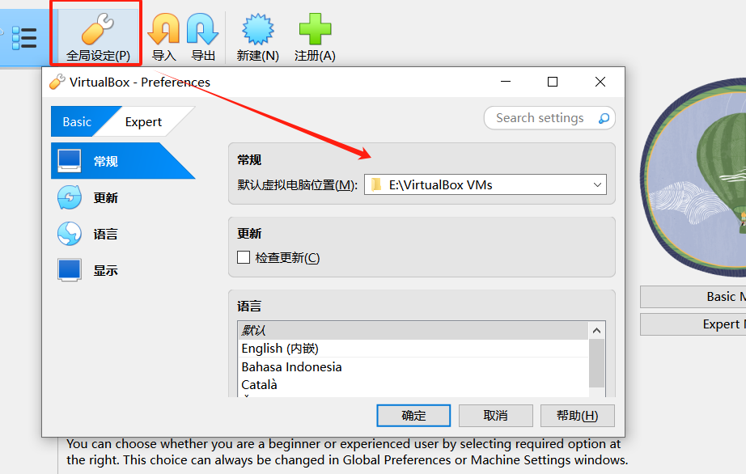
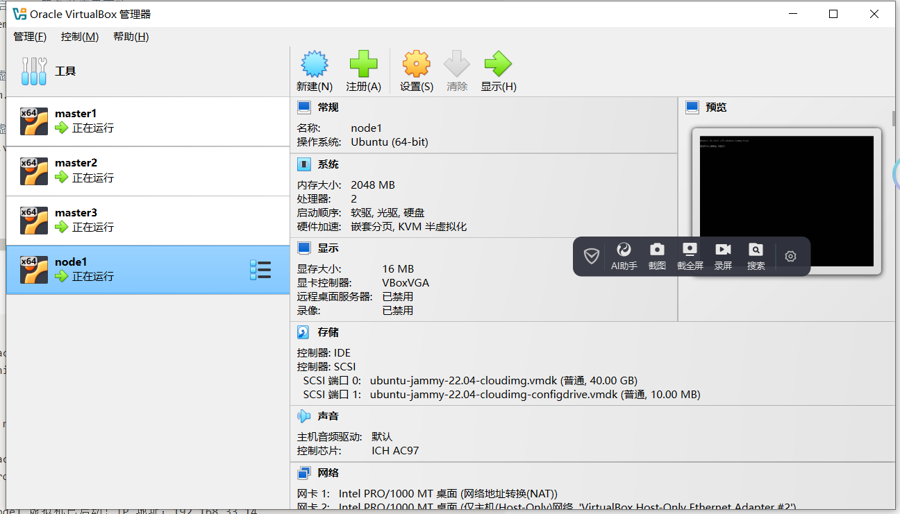
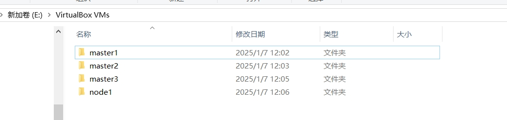

# Vagrant 多节点虚拟机集群搭建

## 概述
本文旨在通过 **Vagrant**快速搭建一个虚拟机集群，为后续的 **Kubernetes**（k8s）安装提供环境支持。**Vagrant** 是一种轻量级的虚拟化管理工具，能够帮助开发者在本地快速创建和管理虚拟机。这种方式非常适合在本地进行研究和测试，尤其是在没有公有云资源或物理服务器的情况下。如果你已经拥有公有云资源或物理服务器，可以直接跳过本篇内容。

## Vagrant 介绍

### 什么是 Vagrant？

[Vagrant](https://developer.hashicorp.com/vagrant/tutorials/getting-started?product_intent=vagrant "vagrant") 是一款由 HashiCorp 开发的开源工具，用于构建和管理虚拟化开发环境。它通过简单的配置文件（Vagrantfile）来定义虚拟机的配置，并支持多种虚拟化提供商（如 VirtualBox、VMware、Hyper-V 等）。Vagrant 的主要目标是让开发环境的搭建和共享变得简单、可重复。

### Box 概念

在 Vagrant 中，**Box** 是一个预配置的虚拟机镜像，类似于 Docker 中的镜像。Box 包含了操作系统和预安装的软件，用户可以通过 Box 快速启动一个虚拟机。Vagrant 官方提供了许多常用的 Box，用户也可以自定义 Box 或从第三方获取。

### Vagrantfile 的用途

**Vagrantfile** 是 Vagrant 的核心配置文件，使用 Ruby 语法编写。它定义了虚拟机的配置信息，包括虚拟机的数量、网络设置、共享文件夹、Provisioning 脚本等。通过 Vagrantfile，用户可以轻松地复制和共享开发环境。

### 虚拟化提供商

Vagrant 支持多种虚拟化提供商，包括：

- **VirtualBox**：开源且免费，支持跨平台（Windows、macOS、Linux）。
- **VMware**：性能较好，但需要购买许可证。
- **Hyper-V**：Windows 自带的虚拟化技术。

### 为什么选择 VirtualBox？

在本文中，我们选择 **VirtualBox** 作为虚拟化提供商，原因如下：

1. **免费开源**：VirtualBox 是完全免费的，适合个人开发者和小团队使用。
2. **跨平台支持**：VirtualBox 支持 Windows、macOS 和 Linux，能够满足大多数开发者的需求。
3. **易于使用**：VirtualBox 的安装和配置相对简单，适合初学者。
4. **与 Vagrant 集成良好**：Vagrant 默认支持 VirtualBox，无需额外配置即可使用。

## 安装所需配置

### 集群规划
我们计划搭建一个 3 Master + 1 Node 的 Kubernetes 集群，具体配置如下：

- Master 节点：3 台，每台最小配置为 2 核 CPU、2GB 内存、30GB 磁盘。

- Node 节点：1 台，最小配置为 2 核 CPU、2GB 内存、30GB 磁盘。

### 前提条件
- 主机需开启虚拟化。

## 搭建多节点虚拟机集群

接下来，我们将通过 Vagrant 和 VirtualBox 搭建一个多节点的虚拟机集群。这个集群将用于后续的 Kubernetes 安装和测试。

### 步骤1： 安装 VirtualBox

- 从[VirtualBox 官网](https://www.virtualbox.org/wiki/Downloads "VirtualBox 下载") 下载并安装适合你操作系统的版本。
- 安装完成后，启动程序，按需设置虚拟机存储目录，防止默认路径空间不足：
    

### 步骤2： 安装 Vagrant

- 从[Vagrant 官网](https://developer.hashicorp.com/vagrant/install?product_intent=vagrant "Vagrant 下载")下载并安装适合你操作系统的版本。

安装完成后，通过以下命令验证是否安装成功：

```
PS D:\workspace\github\LeDaDa-CloudNative-Camp\k8s-ha-cluster-practice\ch1> vagrant --version
Vagrant 2.4.3
```


### 步骤3： 添加 Vagrant box

运行以下命令，添加 ubuntu22.04 版本的 box 镜像：

```

C:\Users\yueyong>vagrant box add https://mirrors.tuna.tsinghua.edu.cn/ubuntu-cloud-images/jammy/current/jammy-server-cloudimg-amd64-vagrant.box --name ubuntu22.04
==> box: Box file was not detected as metadata. Adding it directly...
==> box: Adding box 'ubuntu22.04' (v0) for provider:
box: Downloading: https://mirrors.tuna.tsinghua.edu.cn/ubuntu-cloud-images/jammy/current/jammy-server-cloudimg-amd64-vagrant.box
box:
==> box: Successfully added box 'ubuntu22.04' (v0) for ''!
```
- `--name` 参数用于指定 box 的名称，后续创建虚拟机时会用到。
- 过程中，会自动根据指定的地址下载 box。
- 若需要其它版本，可以自行到[清华镜像源](https://mirrors.tuna.tsinghua.edu.cn/ubuntu-cloud-images "清华镜像源")查找。

验证 box 添加成功：

```
C:\Users\yueyong>vagrant box list
ubuntu22.04 (virtualbox, 0)
```


### 步骤4： 创建 Vagrantfile

在本地创建一个目录，用于存放 Vagrantfile 和相关配置文件。在该目录下创建一个名为 `Vagrantfile` 的文件，内容如下：

```ruby
# 定义虚拟机配置
VMs = [
  {
    :name => "master1",
    :ip => "192.168.33.11",
    :hostname => "master1",
    :password => "brains"
  },
  {
    :name => "master2",
    :ip => "192.168.33.12",
    :hostname => "master2",
    :password => "brains"
  },
  {
    :name => "master3",
    :ip => "192.168.33.13",
    :hostname => "master3",
    :password => "brains"
  },
  {
    :name => "node1",
    :ip => "192.168.33.14",
    :hostname => "node1",
    :password => "brains"
  }
]


Vagrant.configure("2") do |config|
  # 循环创建虚拟机
  VMs.each do |vm|
    config.vm.define vm[:name] do |node|
      node.vm.box = "ubuntu22.04"

      # 配置虚拟机的网络
      node.vm.network "private_network", ip: vm[:ip]

      # 配置虚拟机的提供者 (VirtualBox)
      node.vm.provider "virtualbox" do |vb|
        # 自定义虚拟机的名称
        vb.name = vm[:name]
        # 分配的内存大小 (MB)
        vb.memory = "2048"
        # 分配的 CPU 核心数
        vb.cpus = 2
      end

      # 配置虚拟机的 provision (可选)
      config.vm.provision "shell", inline: <<-SHELL
        # 设置 root 密码
        echo "root:#{vm[:password]}" | chpasswd

        # 允许 root 远程登录
        sed -i 's/#PermitRootLogin prohibit-password/PermitRootLogin yes/' /etc/ssh/sshd_config
        sed -i 's/#PasswordAuthentication no/PasswordAuthentication yes/' /etc/ssh/sshd_config

        # 更新 /etc/ssh/sshd_config.d/60-cloudimg-settings.conf 文件
        sed -i 's/PasswordAuthentication no/PasswordAuthentication yes/' /etc/ssh/sshd_config.d/60-cloudimg-settings.conf


        # 重启 SSH 服务以应用更改
        systemctl restart sshd
      SHELL

      # 配置虚拟机的 hostname (可选)
      node.vm.hostname = vm[:hostname]

      # 配置虚拟机的 post-up 消息 (可选)
      config.vm.post_up_message = "#{vm[:name]} 虚拟机已启动！IP 地址：#{vm[:ip]}"
    end
  end  
end
```
- `VMs` 定义了集群的一组机器信息，包括 名称、ip、主机名以及root 密码，你可以根据你的实际需要进行调整，或者你也可以增减机器数量，取决于你的需求。
- `node.vm.network "private_network", ip: vm[:ip]` 设定虚拟机使用一个虚拟网络以及 ip 地址，默认情况下 vagrant 创建的是 nat 的网络，在主机上是无法直接访问机器的,并且虚拟机之间也无法通信，只能通过端口转发来访问，限制比较大。
- `config.vm.provision "shell"` 部分用于执行脚本开启 root 远程连接的权限，并设置 root 密码。

### 步骤5： 启动虚拟机集群
  
在 `Vagrantfile` 所在目录下，运行以下命令启动虚拟机集群：

```shell
PS D:\workspace\github\LeDaDa-CloudNative-Camp\k8s-ha-cluster-practice\ch1> vagrant up     
Bringing machine 'default' up with 'virtualbox' provider...
......
==> master3:
==> master3: node1 虚拟机已启动！IP 地址：192.168.33.14

==> node1: Machine 'node1' has a post `vagrant up` message. This is a message
==> node1: from the creator of the Vagrantfile, and not from Vagrant itself:
==> node1:
==> node1: node1 虚拟机已启动！IP 地址：192.168.33.14
```
Vagrant 会根据 Vagrantfile 的配置启动 4 个虚拟机。启动完成后，你可以通过以下命令查看虚拟机的状态：

```shell
PS D:\workspace\github\LeDaDa-CloudNative-Camp\k8s-ha-cluster-practice\ch1> vagrant status
Current machine states:

master1                   running (virtualbox)
master2                   running (virtualbox)
master3                   running (virtualbox)
node1                     running (virtualbox)

This environment represents multiple VMs. The VMs are all listed
above with their current state. For more information about a specific
VM, run `vagrant status NAME`.
```
同时，VirtualBox 管理界面中也可以看到虚拟机：

以及在之前设定的存储目录下，可以看到虚拟机文件：



### 步骤6： 登录虚拟机

你可以通过以下vagrant命令（端口转发方式）登录到任意一个虚拟机：

```bash
vagrant ssh master1
vagrant ssh master2
vagrant ssh master3
vagrant ssh master4
```
也可以通过 ssh 目标机器的 ip 直接连接：

```shell
C:\Users\brains>ssh root@192.168.33.11
root@192.168.33.11's password:
Welcome to Ubuntu 22.04.5 LTS (GNU/Linux 5.15.0-127-generic x86_64)

 * Documentation:  https://help.ubuntu.com
 * Management:     https://landscape.canonical.com
 * Support:        https://ubuntu.com/pro

 System information as of Tue Jan  7 07:28:09 UTC 2025

  System load:             0.0
  Usage of /:              3.8% of 38.70GB
  Memory usage:            10%
  Swap usage:              0%
  Processes:               102
  Users logged in:         1
  IPv4 address for enp0s3: 10.0.2.15
  IPv6 address for enp0s3: fd00::a7:b1ff:fefd:e7e2


Expanded Security Maintenance for Applications is not enabled.

0 updates can be applied immediately.

Enable ESM Apps to receive additional future security updates.
See https://ubuntu.com/esm or run: sudo pro status


The list of available updates is more than a week old.
To check for new updates run: sudo apt update
Failed to connect to https://changelogs.ubuntu.com/meta-release-lts. Check your Internet connection or proxy settings


Last login: Tue Jan  7 04:08:01 2025 from 192.168.33.1
root@master1:~#
```
磁盘分区情况如下：
```shell
root@master1:~# df -h
Filesystem      Size  Used Avail Use% Mounted on
tmpfs           197M  984K  196M   1% /run
/dev/sda1        39G  1.5G   38G   4% /
tmpfs           982M     0  982M   0% /dev/shm
tmpfs           5.0M     0  5.0M   0% /run/lock
vagrant         477G  258G  220G  54% /vagrant
tmpfs           197M  4.0K  197M   1% /run/user/0
```
- 可以看到磁盘根分区，用的是镜像默认的 40g 的磁盘设定。
- `/vagrant` 目录是默认挂载，启动目录下的主机文件。

虚拟机之间也可以正常 ping 通：
```shell
root@master1:/vagrant# ping 192.168.33.12
PING 192.168.33.12 (192.168.33.12) 56(84) bytes of data.
64 bytes from 192.168.33.12: icmp_seq=1 ttl=64 time=0.281 ms
64 bytes from 192.168.33.12: icmp_seq=2 ttl=64 time=0.271 ms
^C
--- 192.168.33.12 ping statistics ---
2 packets transmitted, 2 received, 0% packet loss, time 1010ms
```

### 步骤7： 后续操作

由于此集群环境，占用的是主机资源，在不使用的时候，可以通过以下命令暂时停机或者挂起：
```shell
# 关机，不指定name,则关闭当前目录下启动的所有机器
vagrant halt [name]
# 睡眠
vagrant suspend [name]
# 睡眠恢复
vagrant resume [name]
# 若不想要了，可以直接销毁，清理磁盘
vagrant destroy
```

## 总结

通过 Vagrant 和 VirtualBox，我们可以快速在本地搭建一个多节点的虚拟机集群。这种方式成本低、易于管理，非常适合本地开发和测试。如果你有公有云资源或物理服务器，可以直接跳过此步骤。接下来，我们将在这个集群上继续安装和配置 Kubernetes，探索容器编排的更多功能。请保持关注，以获得最新内容。


**如果这篇文章帮助到你，你能给它一个 👏 并考虑关注我以获取更多技巧和窍门，我将非常感激。你的支持对我来说意义重大！**