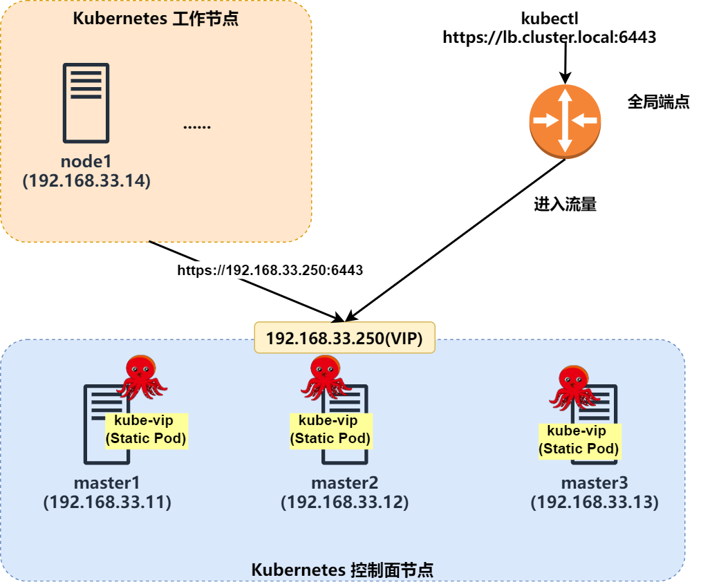

# Kubernetes 1.32 + Kube-Vip：高可用集群部署全攻略

## 概述
Kubernetes（简称 K8S）是一个开源的容器编排平台，用于自动化部署、扩展和管理容器化应用。Kubernetes 集群通常由 Master 节点和 Worker 节点组成。Master 节点负责集群的管理和控制，包括调度、监控、维护集群状态等；而 Worker 节点则负责运行容器化应用。

本文将重点介绍如何在 Kubernetes 1.32 版本中，通过 Kube-Vip 实现 Master 节点的高可用配置。Kube-Vip 是一个轻量级的工具，能够为 Kubernetes 集群提供虚拟 IP 和负载均衡功能，确保在 Master 节点故障时，集群仍能正常运行。

本文的实践基于 4 台虚拟主机，其中 3 台作为 Master 节点，1 台作为 Worker 节点。我们将详细讲解从系统初始化到集群部署的完整过程。如果你对基础的虚拟机集群搭建不熟悉，可以参考上一篇文章：[高可用K8S集群搭建指南（一） : Vagrant 多节点虚拟机集群搭建](https://mp.weixin.qq.com/s/uqbpcEovKLZ61Deq_9qQGw)。

## 环境信息

基于前面安装的 4 台虚拟主机清单及本文计划安装组件信息如下：

| 主机名      | 配置 | 角色 | 系统版本 |IP |安装的组件 |
| ----------- | ----------- | ----------- |----------- |----------- |----------- |
| master1      | 2C2G40G       | master |ubuntu22.04 |192.168.33.11 |kube-vip、apiserver、controller-manager、scheduler、kubelet、etcd、kube-proxy、容器运行时、calico |
| master2      | 2C2G40G       | master |ubuntu22.04 |192.168.33.12 |kube-vip、apiserver、controller-manager、scheduler、kubelet、etcd、kube-proxy、容器运行时、calico |
| master3      | 2C2G40G       | master |ubuntu22.04 |192.168.33.13 |kube-vip、apiserver、controller-manager、scheduler、kubelet、etcd、kube-proxy、容器运行时、calico |
| node1      | 2C2G40G       | worker |ubuntu22.04 |192.168.33.14 |kubelet、kube-proxy、容器运行时、calico、coredns |

简约的架构图如下：



> [kube-vip](https://kube-vip.io/docs/ "kube-vip") 为 Kubernetes 集群提供虚拟 IP 和负载均衡器，用于控制平面（用于构建高可用集群）并支持 Kubernetes LoadBalancer 类型 Services ，无需依赖任何外部硬件或软件。当然你也可以选择 keepalived+haproxy 方式，我选择部署比较方便的 kube-vip。


## 安装

### 步骤1：系统初始化配置

> 说明： 以下操作在所有节点执行。


- 配置 hosts：
  ```shell
  $ cat >> /etc/hosts << EOF
  192.168.33.250 lb.k8s.local
  192.168.33.11 master1 
  192.168.33.12 master2 
  192.168.33.13 master3 
  192.168.33.14 node1
  EOF
  ```
  **注：** hosts 信息根据自身实际情况调整 ip 及对应的主机名。`lb.k8s.local` 是后续 kube-vip 用到的虚拟 ip，按需配置。

- 关闭系统的 swap 分区：
  ```shell
  $ sed -ri 's/^([^#].*swap.*)$/#\1/' /etc/fstab && grep swap /etc/fstab && swapoff -a && free -h
  ```

- 设置内核参数：
  ```shell
  $ cat >> /etc/sysctl.conf <<EOF
  vm.swappiness = 0
  net.bridge.bridge-nf-call-iptables = 1
  net.ipv4.ip_forward = 1
  net.bridge.bridge-nf-call-ip6tables = 1
  EOF

  $ cat >> /etc/modules-load.d/neutron.conf <<EOF
  br_netfilter
  EOF

  #加载模块
  $ modprobe  br_netfilter
  #让配置生效
  $ sysctl -p
  ```
  - `vm.swappiness = 0` 表示尽可能不使用交换分区，优先使用物理内存
  - `net.bridge.bridge-nf-call-iptables = 1` 允许 iptables 规则应用于网桥流量
  - `net.ipv4.ip_forward = 1` 允许系统作为路由器转发 IPv4 数据包
  - `net.bridge.bridge-nf-call-ip6tables = 1` 允许 ip6tables 规则应用于网桥流量
  - `br_netfilter` 用于在网桥上启用 Netfilter 功能，支持 iptables 和 ip6tables 规则

### 步骤2：安装 docker


> 说明： 以下操作在所有节点执行。

我们选择常用的 docker 作为容器运行时，当然你也可以选择其它主流选择，比如 podman。我之前的一些文章对他们有一些讲解，可供参考。

- 更新包管理器索引，确保获取最新的软件包信息：
  
  ```shell
  $ apt update
  ```

- 安装必要的工具和依赖：

  ```shell

  $ apt install -y ca-certificates curl gnupg lsb-release
  ```
  - ca-certificates：用于管理 CA 证书
  - curl：用于从网络下载文件
  - gnupg：用于管理 GPG 密钥
  - lsb-release：用于获取系统发行版信息

- 下载 Docker 的官方 GPG 密钥，并将其转换为适用于 apt 的格式：

  ```shell
  
  $ curl -fsSL https://download.docker.com/linux/ubuntu/gpg | sudo gpg --dearmor -o /usr/share/keyrings/docker-archive-keyring.gpg
  ```
  - -fsSL：静默模式下载，跟随重定向，显示错误信息
  - gpg --dearmor：将 GPG 密钥转换为二进制格式
  - 输出到 /usr/share/keyrings/docker-archive-keyring.gpg

- 添加 Docker 的官方 APT 源：

  ```shell
  
  $ echo "deb [arch=$(dpkg --print-architecture) signed-by=/usr/share/keyrings/docker-archive-keyring.gpg] https://download.docker.com/linux/ubuntu $(lsb_release -cs) stable" | sudo tee /etc/apt/sources.list.d/docker.list > /dev/null

  # 再次更新包管理器索引，以加载新添加的 Docker 源
  $ apt-get update
  ```
  - [arch=$(dpkg --print-architecture)]：自动检测系统架构（如 amd64、arm64）
  - signed-by=/usr/share/keyrings/docker-archive-keyring.gpg：指定 GPG 密钥路径
  - $(lsb_release -cs)：获取系统发行版代号（如 focal、jammy）
  - 将源配置写入 /etc/apt/sources.list.d/docker.list

- 安装 Docker 及相关组件：

  ```shell
  $ apt install docker-ce docker-ce-cli containerd.io docker-compose -y
  ```
  - docker-ce：Docker 社区版
  - docker-ce-cli：Docker 命令行工具
  - containerd.io：容器运行时
  - docker-compose：Docker 容器编排工具

- 创建 Docker 的配置文件 /etc/docker/daemon.json，并写入以下内容：
 
  ```shell

  $ cat > /etc/docker/daemon.json <<EOF
  {
    "registry-mirrors": [
      "https://docker.mirrors.ustc.edu.cn",
      "https://hub-mirror.c.163.com",
      "https://reg-mirror.qiniu.com",
      "https://registry.docker-cn.com"
    ],
    
    "exec-opts": ["native.cgroupdriver=systemd"],
    "data-root": "/data/docker",
    "log-driver": "json-file",
    "log-opts": {
      "max-size": "20m",  
      "max-file": "5"     
    }
  }
  EOF
  ```
  - `registry-mirrors` 配置 Docker 镜像加速器（国内镜像源）
  - `exec-opts` 设置 Cgroup 驱动为 systemd（适用于使用 systemd 的系统）
  - `data-root` 设置 Docker 数据存储路径为 /data/docker
  - `log-driver` 配置日志驱动为 json-file
  - `log-opts` 配置日志文件的大小和数量限制

- 重启 Docker 服务，使配置生效：

  ```shell
  $ systemctl restart docker.service
  ```

- 设置 Docker 服务开机自启：

  ```shell
  $ systemctl enable docker.service
  ```

- 查看 Docker 系统信息，验证安装和配置是否成功：

  ```shell
  docker info
  ```

### 步骤3：安装最新版本的 kubeadm、kubelet、kubectl

> 说明： 以下操作在所有节点执行。

- 配置安装源：
  ```shell
  $ apt-get update && apt-get install -y apt-transport-https
  $ curl -fsSL https://mirrors.aliyun.com/kubernetes-new/core/stable/v1.32/deb/Release.key |
    gpg --dearmor -o /etc/apt/keyrings/kubernetes-apt-keyring.gpg
  $ echo "deb [signed-by=/etc/apt/keyrings/kubernetes-apt-keyring.gpg] https://mirrors.aliyun.com/kubernetes-new/core/stable/v1.32/deb/ /" |
    tee /etc/apt/sources.list.d/kubernetes.list
  ```
  **注**：我目前安装的是 1.32 ,如果你需要安装其他版本，替换版本号即可。
  - `apt-get update` 更新本地包索引，确保获取最新的软件包信息。
  -  `apt-get install -y apt-transport-https` 安装 apt-transport-https 包，使 apt 能够通过 HTTPS 协议访问软件源。
  - `curl -fsSL` 静默模式下载，跟随重定向，显示错误信息。
  - `gpg --dearmor` 将 GPG 密钥转换为二进制格式。
  - `-o /etc/apt/keyrings/kubernetes-apt-keyring.gpg` 将转换后的密钥保存到指定路径。
  - `[signed-by=/etc/apt/keyrings/kubernetes-apt-keyring.gpg]` 指定 GPG 密钥路径，用于验证软件包的签名。
  - `https://mirrors.aliyun.com/kubernetes-new/core/stable/v1.32/deb/` 阿里云的 Kubernetes 软件源地址。

- 安装 kubelet、kubeadm、kubectl：
  ```shell
  $ apt-get update
  $ apt-get install -y kubelet kubeadm kubectl
  ```
- 确认安装版本：
  ```shell
  $ kubectl version
  Client Version: v1.32.0
  Kustomize Version: v5.5.0

  $ kubeadm version
  kubeadm version: &version.Info{Major:"1", Minor:"32", GitVersion:"v1.32.0", GitCommit:"70d3cc986aa8221cd1dfb1121852688902d3bf53", GitTreeState:"clean", BuildDate:"2024-12-11T18:04:20Z", GoVersion:"go1.23.3", Compiler:"gc", Platform:"linux/amd64"}

  $ kubelet --version
  Kubernetes v1.32.0
  ```

- 设置 kubelet 自启动：
  ```shell
  $ systemctl enable kubelet
  ```
  **注**：此时，还不能启动 kubelet，因为集群还没配置，仅仅设置开机自启动。

### 步骤4：Docker 垫片安装 （可选）

> 说明： 以下操作在所有节点执行。**注**：非 docker 容器运行时可跳过本步骤。


> 自 Kubernetes v1.24 版本起，移除了对 Docker Shim 的支持，而 Docker Engine 默认并不兼容 CRI（容器运行时接口）规范，导致两者无法直接集成。为了解决这一问题，Mirantis 和 Docker 共同开发了 **cri-dockerd** 项目。该项目为 Docker Engine 提供了一个支持 CRI 规范的适配层，使得 Kubernetes 能够通过 CRI 接口管理和控制 Docker。

[cri-dockerd 项目](https://github.com/Mirantis/cri-dockerd "cri-dockerd 项目") 提供了 RPM 包，可在 github 仓库的 release 界面获取：


> Ubuntu的版本分别代表不同的大版本
> 
> 24.04：Noble
> 
> 22.04：jammy
> 
> 20.04：focal
> 
> 18.04：bionic
> 
> 16.04：xenial
> 
> 14.04：trusty

我用的是 22.04 版本，所以选择 jammy。

- 安装 cri-dockerd:
  ```shell
  $ wget https://github.com/Mirantis/cri-dockerd/releases/download/v0.3.16/cri-dockerd_0.3.16.3-0.ubuntu-jammy_amd64.deb
  $ dpkg -i ./cri-dockerd_0.3.16.3-0.ubuntu-jammy_amd64.deb
  ```
  **注**：无法访问 github 的同学，可以至文末参考链接中的 gitee 项目中获取。

- 配置 cri-dockerd:
  因为国内无法下载 k8s.gcr.io 的仓库镜像，所以需要修改 cri-dockerd 使用国内镜像源，设置国内源方法如下：
  ```shell
  $ sed -ri 's@^(.*fd://).*$@\1 --pod-infra-container-image registry.aliyuncs.com/google_containers/pause@' /usr/lib/systemd/system/cri-docker.service

  # 重启
  $ systemctl daemon-reload && systemctl restart cri-docker && systemctl enable cri-docker
  ```
  - `sed -ri` 命令修改cri-docker.service 文件涉及镜像的一行内容为 `ExecStart=/usr/bin/cri-dockerd --container-runtime-endpoint fd:// --pod-infra-container-image registry.aliyuncs.com/google_containers/pause`

### 步骤5：生成 kube-vip 配置文件
> 说明：以下操作在第一个 master 节点执行即可。

- 生成 kube-vip 静态 yaml 配置文件：
  ```shell
  $ export VIP=192.168.33.250
  $ export INTERFACE=enp0s8
  $ export KVVERSION=v0.8.8
  $ docker run --network host --rm registry.cn-shanghai.aliyuncs.com/yydd/kube-vip:$KVVERSION manifest pod \
      --interface $INTERFACE \
      --address $VIP \
      --controlplane \
      --services \
      --arp \
      --leaderElection | tee /etc/kubernetes/manifests/kube-vip.yaml
  ```
  - `export VIP=192.168.33.250` 用于设置 vip 的地址，主要要与节点 ip 在同一子网。和第一步中设置的 lb 主机名的 ip 要一致。
  - `export INTERFACE=enp0s8` 虚拟ip 绑定的网卡，通过 `ip a` 可查看网卡清单，此处我们选择 基于 vagrant 创建的第二块卡，你需要根据实际来调整。
  - `export KVVERSION=v0.8.8` kube-vip 的版本，通过 `https://api.github.com/repos/kube-vip/kube-vip/releases` 可查看版本信息。
  - `docker run` 命令会基于 kube-vip 镜像加上你的参数，生成最终的一个用于后续部署的 manifest 文件，注意输出目录是`/etc/kubernetes/manifests`,此目录不可调整，这是 k8s static pod 目录，后续 init 时会自动创建服务。
  - `kube-vip:v0.8.8` 镜像我已推送到阿里云仓库，直接使用即可。
  - `manifest pod ...` 是 kube-vip 容器运行的指令，用于生成一个 kubernetes pod 的清单文件，该清单文件用于运行 Kube-Vip 的Pod。
  - `--controlplane` 启用 kube-vip 控制平面功能。
  - `--services` 使 kube-vip 能够监视 LoadBalancer 类型的Service。
  - `--arp` 启用 ARP（地址解析协议）广播，用于让其他网络设备能够知道虚拟 IP 地址。这对于确保网络中的其他机器能够正确解析虚拟 IP 地址并路由流量至 Kube-Vip 是必要的。
  - `--leaderElection` 启用 Kubernetes LeaderElection,由 ARP 使用，因为只有领导者可以广播,领导者选举机制，确保集群中只有一个 Kube-Vip 实例在任何时刻管理虚拟 IP。

- 修改 `kube-vip.yaml` 镜像为阿里云镜像：
  ```shell
  $ sed -i 's|ghcr.io/kube-vip/kube-vip:v0.8.8|registry.cn-shanghai.aliyuncs.com/yydd/kube-vip:v0.8.8|' /etc/kubernetes/manifests/kube-vip.yaml
  ```
- 复制 `kube-vip.yaml` 到其他两个 master 节点：

  ```shell 
  $ scp -r /etc/kubernetes/manifests/kube-vip.yaml 192.168.33.12:/etc/kubernetes/manifests/
  $ scp -r /etc/kubernetes/manifests/kube-vip.yaml 192.168.33.13:/etc/kubernetes/manifests/

  ```
- 修改 `kube-vip.yaml` 中挂载 k8s 配置文件为 super-admin.conf:

  ```shell
  $ sed -i 's|path: /etc/kubernetes/admin.conf|path: /etc/kubernetes/super-admin.conf|' /etc/kubernetes/manifests/kube-vip.yaml
  ```
  **注**：因为没有更改这个配置，kube-vip 一直起不来，报错没有权限获取 k8s 的某些资源，通过查看 issue 才发现 k8s1.29 之后，需要在第一个主节点设置挂载 super-admin.conf(也只有第一个初始化主节点才有这个配置文件)。

### 步骤6：开始初始化
> 说明：以下操作在第一个 master 节点执行即可。

- 生成初始化配置文件：
  ```shell
  $ kubeadm config print init-defaults --component-configs KubeProxyConfiguration > kubeadm.yaml

  ```

- 修改上一步生成的`kubeadm.yaml`配置文件：
  ```yaml
  apiVersion: kubeadm.k8s.io/v1beta4
  bootstrapTokens:
  - groups:
    - system:bootstrappers:kubeadm:default-node-token
    token: abcdef.0123456789abcdef
    ttl: 24h0m0s
    usages:
    - signing
    - authentication
  kind: InitConfiguration
  localAPIEndpoint:
    # 修改为 master1 ip
    advertiseAddress: 192.168.33.11
    bindPort: 6443
  nodeRegistration:
    # 修改成 cri-dockerd 的 sock
    criSocket: unix:///run/cri-dockerd.sock
    imagePullPolicy: IfNotPresent
    imagePullSerial: true
    # 修改为 master1 主机名
    name: master1
    taints: null
  timeouts:
    controlPlaneComponentHealthCheck: 4m0s
    discovery: 5m0s
    etcdAPICall: 2m0s
    kubeletHealthCheck: 4m0s
    kubernetesAPICall: 1m0s
    tlsBootstrap: 5m0s
    upgradeManifests: 5m0s
  ---
  apiServer: 
    # 添加如下参数
    timeoutForControlPlane: 4m0s
    certSANs:
    # vip 以及主机 hosts ip
    - lb.k8s.local
    - master1
    - master2
    - master3
    - node1
    - 192.168.33.11
    - 192.168.33.12
    - 192.168.33.13
    - 192.168.33.14
  # 如果是多master节点，就需要添加这项，指向第一步设定的 vip 的hosts
  controlPlaneEndpoint: "lb.k8s.local:6443"
  apiVersion: kubeadm.k8s.io/v1beta4
  caCertificateValidityPeriod: 87600h0m0s
  certificateValidityPeriod: 8760h0m0s
  certificatesDir: /etc/kubernetes/pki
  clusterName: kubernetes
  controllerManager: {}
  dns: {}
  encryptionAlgorithm: RSA-2048
  etcd:
    local:
      # 按需调整 etcd 数据目录
      dataDir: /data/etcd
  # 修改镜像加速地址
  imageRepository: registry.aliyuncs.com/google_containers
  kind: ClusterConfiguration
  kubernetesVersion: 1.32.0
  networking:
    dnsDomain: cluster.local
    serviceSubnet: 10.96.0.0/12
    # 添加pod的IP地址设置（按需调整）
    podSubnet: 10.244.0.0/16
  proxy: {}
  scheduler: {}
  ---
  apiVersion: kubeproxy.config.k8s.io/v1alpha1
  bindAddress: 0.0.0.0
  bindAddressHardFail: false
  clientConnection:
    acceptContentTypes: ""
    burst: 0
    contentType: ""
    kubeconfig: /var/lib/kube-proxy/kubeconfig.conf
    qps: 0
  clusterCIDR: ""
  configSyncPeriod: 0s
  conntrack:
    maxPerCore: null
    min: null
    tcpBeLiberal: false
    tcpCloseWaitTimeout: null
    tcpEstablishedTimeout: null
    udpStreamTimeout: 0s
    udpTimeout: 0s
  detectLocal:
    bridgeInterface: ""
    interfaceNamePrefix: ""
  detectLocalMode: ""
  enableProfiling: false
  healthzBindAddress: ""
  hostnameOverride: ""
  iptables:
    localhostNodePorts: null
    masqueradeAll: false
    masqueradeBit: null
    minSyncPeriod: 0s
    syncPeriod: 0s
  ipvs:
    excludeCIDRs: null
    minSyncPeriod: 0s
    scheduler: ""
    strictARP: false
    syncPeriod: 0s
    tcpFinTimeout: 0s
    tcpTimeout: 0s
    udpTimeout: 0s
  kind: KubeProxyConfiguration
  logging:
    flushFrequency: 0
    options:
      json:
        infoBufferSize: "0"
      text:
        infoBufferSize: "0"
    verbosity: 0
  metricsBindAddress: ""
  # 修改为 ipvs
  mode: "ipvs"
  nftables:
    masqueradeAll: false
    masqueradeBit: null
    minSyncPeriod: 0s
    syncPeriod: 0s
  nodePortAddresses: null
  oomScoreAdj: null
  portRange: ""
  showHiddenMetricsForVersion: ""
  winkernel:
    enableDSR: false
    forwardHealthCheckVip: false
    networkName: ""
    rootHnsEndpointName: ""
    sourceVip: ""
  ---
  # 在最后添加
  apiVersion: kubelet.config.k8s.io/v1beta1
  kind: KubeletConfiguration
  cgroupDriver: systemd
  ```

- 基于上一步修改完成的 `kubeadm.yaml`文件，执行集群初始化：
  ```shell
  $ kubeadm init --upload-certs --config=kubeadm.yaml
  ```
- 等待出现类似以下的输出，代表初始化成功：
  ```shell
  root@master1:~# kubeadm init --upload-certs --config=kubeadm.yaml
  W0113 07:54:18.346337    7482 initconfiguration.go:332] error unmarshaling configuration schema.GroupVersionKind{Group:"kubeadm.k8s.io", Version:"v1beta4", Kind:"ClusterConfiguration"}: strict decoding error: unknown field "apiServer.timeoutForControlPlane"
  [init] Using Kubernetes version: v1.32.0
  [preflight] Running pre-flight checks
  [preflight] Pulling images required for setting up a Kubernetes cluster
  [preflight] This might take a minute or two, depending on the speed of your internet connection
  [preflight] You can also perform this action beforehand using 'kubeadm config images pull'
  W0113 07:54:18.528435    7482 checks.go:846] detected that the sandbox image "registry.aliyuncs.com/google_containers/pause" of the container runtime is inconsistent with that used by kubeadm.It is recommended to use "registry.aliyuncs.com/google_containers/pause:3.10" as the CRI sandbox image.
  [certs] Using certificateDir folder "/etc/kubernetes/pki"
  [certs] Generating "ca" certificate and key
  [certs] Generating "apiserver" certificate and key
  [certs] apiserver serving cert is signed for DNS names [kubernetes kubernetes.default kubernetes.default.svc kubernetes.default.svc.cluster.local lb.k8s.local master1 master2 master3 node1] and IPs [10.96.0.1 192.168.33.11 192.168.33.12 192.168.33.13 192.168.33.14]
  [certs] Generating "apiserver-kubelet-client" certificate and key
  [certs] Generating "front-proxy-ca" certificate and key
  [certs] Generating "front-proxy-client" certificate and key
  [certs] Generating "etcd/ca" certificate and key
  [certs] Generating "etcd/server" certificate and key
  [certs] etcd/server serving cert is signed for DNS names [localhost master1] and IPs [192.168.33.11 127.0.0.1 ::1]
  [certs] Generating "etcd/peer" certificate and key
  [certs] etcd/peer serving cert is signed for DNS names [localhost master1] and IPs [192.168.33.11 127.0.0.1 ::1]
  [certs] Generating "etcd/healthcheck-client" certificate and key
  [certs] Generating "apiserver-etcd-client" certificate and key
  [certs] Generating "sa" key and public key
  [kubeconfig] Using kubeconfig folder "/etc/kubernetes"
  [kubeconfig] Writing "admin.conf" kubeconfig file
  [kubeconfig] Writing "super-admin.conf" kubeconfig file
  [kubeconfig] Writing "kubelet.conf" kubeconfig file
  [kubeconfig] Writing "controller-manager.conf" kubeconfig file
  [kubeconfig] Writing "scheduler.conf" kubeconfig file
  [etcd] Creating static Pod manifest for local etcd in "/etc/kubernetes/manifests"
  [control-plane] Using manifest folder "/etc/kubernetes/manifests"
  [control-plane] Creating static Pod manifest for "kube-apiserver"
  [control-plane] Creating static Pod manifest for "kube-controller-manager"
  [control-plane] Creating static Pod manifest for "kube-scheduler"
  [kubelet-start] Writing kubelet environment file with flags to file "/var/lib/kubelet/kubeadm-flags.env"
  [kubelet-start] Writing kubelet configuration to file "/var/lib/kubelet/config.yaml"
  [kubelet-start] Starting the kubelet
  [wait-control-plane] Waiting for the kubelet to boot up the control plane as static Pods from directory "/etc/kubernetes/manifests"
  [kubelet-check] Waiting for a healthy kubelet at http://127.0.0.1:10248/healthz. This can take up to 4m0s
  [kubelet-check] The kubelet is healthy after 505.620541ms
  [api-check] Waiting for a healthy API server. This can take up to 4m0s
  [api-check] The API server is healthy after 9.50204379s
  [upload-config] Storing the configuration used in ConfigMap "kubeadm-config" in the "kube-system" Namespace
  [kubelet] Creating a ConfigMap "kubelet-config" in namespace kube-system with the configuration for the kubelets in the cluster
  [upload-certs] Storing the certificates in Secret "kubeadm-certs" in the "kube-system" Namespace
  [upload-certs] Using certificate key:
  38e97e7c5860dda6b9c27093e9c1f96caf3f61cc9e93ca0faa517a49d592b096
  [mark-control-plane] Marking the node master1 as control-plane by adding the labels: [node-role.kubernetes.io/control-plane node.kubernetes.io/exclude-from-external-load-balancers]
  [mark-control-plane] Marking the node master1 as control-plane by adding the taints [node-role.kubernetes.io/control-plane:NoSchedule]
  [bootstrap-token] Using token: abcdef.0123456789abcdef
  [bootstrap-token] Configuring bootstrap tokens, cluster-info ConfigMap, RBAC Roles
  [bootstrap-token] Configured RBAC rules to allow Node Bootstrap tokens to get nodes
  [bootstrap-token] Configured RBAC rules to allow Node Bootstrap tokens to post CSRs in order for nodes to get long term certificate credentials
  [bootstrap-token] Configured RBAC rules to allow the csrapprover controller automatically approve CSRs from a Node Bootstrap Token
  [bootstrap-token] Configured RBAC rules to allow certificate rotation for all node client certificates in the cluster
  [bootstrap-token] Creating the "cluster-info" ConfigMap in the "kube-public" namespace
  [kubelet-finalize] Updating "/etc/kubernetes/kubelet.conf" to point to a rotatable kubelet client certificate and key
  [addons] Applied essential addon: CoreDNS
  [addons] Applied essential addon: kube-proxy

  Your Kubernetes control-plane has initialized successfully!

  To start using your cluster, you need to run the following as a regular user:

    mkdir -p $HOME/.kube
    sudo cp -i /etc/kubernetes/admin.conf $HOME/.kube/config
    sudo chown $(id -u):$(id -g) $HOME/.kube/config

  Alternatively, if you are the root user, you can run:

    export KUBECONFIG=/etc/kubernetes/admin.conf

  You should now deploy a pod network to the cluster.
  Run "kubectl apply -f [podnetwork].yaml" with one of the options listed at:
    https://kubernetes.io/docs/concepts/cluster-administration/addons/

  You can now join any number of control-plane nodes running the following command on each as root:

    kubeadm join lb.k8s.local:6443 --token abcdef.0123456789abcdef \
          --discovery-token-ca-cert-hash sha256:0153935bdcd1228663ed02045d6c480b1457319f942a8f01ff5765650f226b2d \
          --control-plane --certificate-key 38e97e7c5860dda6b9c27093e9c1f96caf3f61cc9e93ca0faa517a49d592b096

  Please note that the certificate-key gives access to cluster sensitive data, keep it secret!
  As a safeguard, uploaded-certs will be deleted in two hours; If necessary, you can use
  "kubeadm init phase upload-certs --upload-certs" to reload certs afterward.

  Then you can join any number of worker nodes by running the following on each as root:

  kubeadm join lb.k8s.local:6443 --token abcdef.0123456789abcdef \
          --discovery-token-ca-cert-hash sha256:0153935bdcd1228663ed02045d6c480b1457319f942a8f01ff5765650f226b2d
  ```
  **注：** 最后的两个关键的输出，分别指出了新的 master 以及 worker 节点加入集群的命令。
- 按照以上输出，创建配置文件目录并复制配置文件：

  ```shell
  $ mkdir -p $HOME/.kube
  $ sudo cp -i /etc/kubernetes/admin.conf $HOME/.kube/config
  $ sudo chown $(id -u):$(id -g) $HOME/.kube/config
  ```
- 此时，通过执行 `ip a` 可以发现 vip 已经在第一个节点生效：

  ```shell
  root@master1:~# ip a
  1: lo: <LOOPBACK,UP,LOWER_UP> mtu 65536 qdisc noqueue state UNKNOWN group default qlen 1000
      link/loopback 00:00:00:00:00:00 brd 00:00:00:00:00:00
      inet 127.0.0.1/8 scope host lo
        valid_lft forever preferred_lft forever
      inet6 ::1/128 scope host 
        valid_lft forever preferred_lft forever
  2: enp0s3: <BROADCAST,MULTICAST,UP,LOWER_UP> mtu 1500 qdisc fq_codel state UP group default qlen 1000
      link/ether 02:3e:24:fa:6f:1a brd ff:ff:ff:ff:ff:ff
      inet 10.0.2.15/24 metric 100 brd 10.0.2.255 scope global dynamic enp0s3
        valid_lft 85677sec preferred_lft 85677sec
      inet6 fd00::3e:24ff:fefa:6f1a/64 scope global dynamic mngtmpaddr noprefixroute 
        valid_lft 86209sec preferred_lft 14209sec
      inet6 fe80::3e:24ff:fefa:6f1a/64 scope link 
        valid_lft forever preferred_lft forever
  3: enp0s8: <BROADCAST,MULTICAST,UP,LOWER_UP> mtu 1500 qdisc fq_codel state UP group default qlen 1000
      link/ether 08:00:27:51:5f:7e brd ff:ff:ff:ff:ff:ff
      inet 192.168.33.11/24 brd 192.168.33.255 scope global enp0s8
        valid_lft forever preferred_lft forever
      inet 192.168.33.250/32 scope global enp0s8
        valid_lft forever preferred_lft forever
      inet6 fe80::a00:27ff:fe51:5f7e/64 scope link 
        valid_lft forever preferred_lft forever
  4: docker0: <NO-CARRIER,BROADCAST,MULTICAST,UP> mtu 1500 qdisc noqueue state DOWN group default 
      link/ether 02:42:68:e4:92:3e brd ff:ff:ff:ff:ff:ff
      inet 172.17.0.1/16 brd 172.17.255.255 scope global docker0
        valid_lft forever preferred_lft forever
  5: kube-ipvs0: <BROADCAST,NOARP> mtu 1500 qdisc noop state DOWN group default 
      link/ether 22:ec:0f:67:18:c7 brd ff:ff:ff:ff:ff:ff
      inet 10.96.0.1/32 scope global kube-ipvs0
        valid_lft forever preferred_lft forever
      inet 10.96.0.10/32 scope global kube-ipvs0
        valid_lft forever preferred_lft forever
  ```
- 查看节点状态，当前因未安装网络插件，节点处于 NotReady 状态：

  ```shell
  root@master1:~# kubectl get node
  NAME      STATUS     ROLES           AGE     VERSION
  master1   NotReady   control-plane   9m38s   v1.32.0
  ```
- 查看 Pod 状态，当前因未安装网络插件， coredns pod 处于 Pending 状态：

  ```shell
  root@master1:~# kubectl get pod -A
  NAMESPACE     NAME                              READY   STATUS    RESTARTS   AGE
  kube-system   coredns-6766b7b6bb-f2shx          0/1     Pending   0          10m
  kube-system   coredns-6766b7b6bb-vsl65          0/1     Pending   0          10m
  kube-system   etcd-master1                      1/1     Running   0          10m
  kube-system   kube-apiserver-master1            1/1     Running   0          10m
  kube-system   kube-controller-manager-master1   1/1     Running   0          10m
  kube-system   kube-proxy-ldsp7                  1/1     Running   0          10m
  kube-system   kube-scheduler-master1            1/1     Running   0          10m
  kube-system   kube-vip-master1                  1/1     Running   0          10m
  ```


### 步骤7：安装 Calico 网络插件

> 说明：以下操作在第一个 master 节点执行即可。

- 下载 calico 清单文件：

  ```shell
  $ wget https://docs.projectcalico.org/manifests/calico.yaml
  ```
- 无法拉取 docker 官方仓库镜像的同学，替换阿里云镜像：

  ```shell
  $ sed -i 's|docker.io/calico/cni:v3.25.0|registry.cn-shanghai.aliyuncs.com/yydd/calico:cni_v3.25.0|' calico.yaml
  $ sed -i 's|docker.io/calico/node:v3.25.0|registry.cn-shanghai.aliyuncs.com/yydd/calico:node_v3.25.0|' calico.yaml
  $ sed -i 's|docker.io/calico/kube-controllers:v3.25.0|registry.cn-shanghai.aliyuncs.com/yydd/calico:kube-controllers_v3.25.0|' calico.yaml
  ```
- 因为 vagrant 创建有多网卡，需要指定网卡信息：
  
  ```shell
  $ sed -i '/name: CALICO_IPV4POOL_VXLAN/i \
              - name: IP_AUTODETECTION_METHOD\n              value: "interface=enp0s8"' calico.yaml

  ```
  **注**：网卡根据实际调整。

- 修改 CIDR，与上面初始化设置的 Pod 网段一致：

  ```shell
  $ sed -i '/# - name: CALICO_IPV4POOL_CIDR/ {s/# //; n; s/# //; s/"192.168.0.0\/16"/"10.244.0.0\/16"/}' calico.yaml
  ```
- 执行命令，部署 Calico:

  ```shell
  $ kubectl apply -f calico.yaml

  ```

- 通过命令持续观察各服务容器状态（耐心等待 Running）：

  ```shell
  $ watch kubectl get pods --all-namespaces -o wide
  Every 2.0s: kubectl get pods --all-namespaces -o wide                                                                                                     master1: Sat Jan 11 16:08:02 2025

  NAMESPACE     NAME                                       READY   STATUS    RESTARTS   AGE     IP              NODE      NOMINATED NODE   READINESS GATES
  kube-system   calico-kube-controllers-74dfd97c55-vgw8b   1/1     Running   0          3m21s   10.244.137.65   master1   <none>           <none>
  kube-system   calico-node-82g4v                          1/1     Running   0          3m21s   192.168.33.11   master1   <none>           <none>
  kube-system   coredns-6766b7b6bb-f2shx                   1/1     Running   0          64m     10.244.137.67   master1   <none>           <none>
  kube-system   coredns-6766b7b6bb-vsl65                   1/1     Running   0          64m     10.244.137.66   master1   <none>           <none>
  kube-system   etcd-master1                               1/1     Running   0          64m     192.168.33.11   master1   <none>           <none>
  kube-system   kube-apiserver-master1                     1/1     Running   0          64m     192.168.33.11   master1   <none>           <none>
  kube-system   kube-controller-manager-master1            1/1     Running   0          64m     192.168.33.11   master1   <none>           <none>
  kube-system   kube-proxy-ldsp7                           1/1     Running   0          64m     192.168.33.11   master1   <none>           <none>
  kube-system   kube-scheduler-master1                     1/1     Running   0          64m     192.168.33.11   master1   <none>           <none>
  kube-system   kube-vip-master1                           1/1     Running   0          64m     192.168.33.11   master1   <none>           <none>
  ```
- 查看节点状态，正常：

  ```shell
  root@master1:~# kubectl get node
  NAME      STATUS   ROLES           AGE   VERSION
  master1   Ready    control-plane   66m   v1.32.0
  ```

### 步骤8：加入其它 Master 节点

> 说明：以下操作分别在第 2 个及第 3 个 master 节点执行即可。

- master 加入集群：

  ```shell
  $ kubeadm join lb.k8s.local:6443 --token abcdef.0123456789abcdef \
        --discovery-token-ca-cert-hash sha256:0153935bdcd1228663ed02045d6c480b1457319f942a8f01ff5765650f226b2d \
        --control-plane --certificate-key 38e97e7c5860dda6b9c27093e9c1f96caf3f61cc9e93ca0faa517a49d592b096 --cri-socket unix:///run/cri-dockerd.sock --apiserver-advertise-address 192.168.33.12
  ```
  - 如果初始化后未记录节点加入命令，可以通过运行以下命令重新生成：`kubeadm token create --print-join-command --ttl 0`。
  - `--control-plane` 用于指定作为控制平面加入集群。
  - `--cri-socket unix:///run/cri-dockerd.sock` 基于 docker 容器运行时，一定要加上此垫片 socket 参数。
  - `--apiserver-advertise-address` 此参数用于识别当前节点加入集群是识别的ip，一定要指定，要不然会使用默认的 vagrant 的 第一块卡 ip，导致其它节点无法通信，一定要指定加入的 master 节点实际可通信的 ip。
  - 若 join 失败，可执行 `kubeadm reset --cri-socket unix:///run/cri-dockerd.sock` 进行清理。


### 步骤9：加入 Worker 节点
> 说明：以下操作在 node1 节点执行即可。(如果有多个worker 节点分别执行即可)。

- worker 加入集群：

  ```shell
  $ kubeadm join lb.k8s.local:6443 --token abcdef.0123456789abcdef \
        --discovery-token-ca-cert-hash sha256:0153935bdcd1228663ed02045d6c480b1457319f942a8f01ff5765650f226b2d --cri-socket unix:///run/cri-dockerd.sock
  ```
  - 如果初始化后未记录节点加入命令，可以通过运行以下命令重新生成：`kubeadm token create --print-join-command --ttl 0`。
  - `--cri-socket unix:///run/cri-dockerd.sock` 基于 docker 容器运行时，一定要加上此垫片 socket 参数。
  - 若 join 失败，可执行 `kubeadm reset --cri-socket unix:///run/cri-dockerd.sock` 进行清理。

### 步骤10：验证集群功能

- 查看所有节点状态：

  ```shell
  root@master1:~# kubectl get node -o wide 
  NAME      STATUS   ROLES           AGE     VERSION   INTERNAL-IP     EXTERNAL-IP   OS-IMAGE             KERNEL-VERSION       CONTAINER-RUNTIME
  master1   Ready    control-plane   37m     v1.32.0   192.168.33.11   <none>        Ubuntu 22.04.5 LTS   5.15.0-130-generic   docker://27.4.1
  master2   Ready    control-plane   12m     v1.32.0   192.168.33.12   <none>        Ubuntu 22.04.5 LTS   5.15.0-130-generic   docker://27.4.1
  master3   Ready    control-plane   12m     v1.32.0   192.168.33.13   <none>        Ubuntu 22.04.5 LTS   5.15.0-130-generic   docker://27.4.1
  node1     Ready    <none>          4m22s   v1.32.0   192.168.33.14   <none>        Ubuntu 22.04.5 LTS   5.15.0-130-generic   docker://27.4.1
  ```

- 最终运行的 Pods 清单：

  ```shell
  root@master1:~# kubectl get pods -A -o wide
  NAMESPACE     NAME                                       READY   STATUS    RESTARTS   AGE    IP              NODE      NOMINATED NODE   READINESS GATES
  kube-system   calico-kube-controllers-74dfd97c55-cv98z   1/1     Running   0          35m    10.244.137.66   master1   <none>           <none>
  kube-system   calico-node-5b5pq                          1/1     Running   0          13m    192.168.33.12   master2   <none>           <none>
  kube-system   calico-node-7pfd5                          1/1     Running   0          35m    192.168.33.11   master1   <none>           <none>
  kube-system   calico-node-dbr49                          1/1     Running   0          13m    192.168.33.13   master3   <none>           <none>
  kube-system   calico-node-plvh6                          1/1     Running   0          5m4s   192.168.33.14   node1     <none>           <none>
  kube-system   coredns-6766b7b6bb-gr28c                   1/1     Running   0          37m    10.244.137.65   master1   <none>           <none>
  kube-system   coredns-6766b7b6bb-s6gcl                   1/1     Running   0          37m    10.244.137.67   master1   <none>           <none>
  kube-system   etcd-master1                               1/1     Running   0          37m    192.168.33.11   master1   <none>           <none>
  kube-system   etcd-master2                               1/1     Running   0          13m    192.168.33.12   master2   <none>           <none>
  kube-system   etcd-master3                               1/1     Running   0          12m    192.168.33.13   master3   <none>           <none>
  kube-system   kube-apiserver-master1                     1/1     Running   0          37m    192.168.33.11   master1   <none>           <none>
  kube-system   kube-apiserver-master2                     1/1     Running   0          13m    192.168.33.12   master2   <none>           <none>
  kube-system   kube-apiserver-master3                     1/1     Running   0          12m    192.168.33.13   master3   <none>           <none>
  kube-system   kube-controller-manager-master1            1/1     Running   0          37m    192.168.33.11   master1   <none>           <none>
  kube-system   kube-controller-manager-master2            1/1     Running   0          13m    192.168.33.12   master2   <none>           <none>
  kube-system   kube-controller-manager-master3            1/1     Running   0          12m    192.168.33.13   master3   <none>           <none>
  kube-system   kube-proxy-c2xbq                           1/1     Running   0          13m    192.168.33.13   master3   <none>           <none>
  kube-system   kube-proxy-g2k92                           1/1     Running   0          5m4s   192.168.33.14   node1     <none>           <none>
  kube-system   kube-proxy-kcsd5                           1/1     Running   0          37m    192.168.33.11   master1   <none>           <none>
  kube-system   kube-proxy-ndlmm                           1/1     Running   0          13m    192.168.33.12   master2   <none>           <none>
  kube-system   kube-scheduler-master1                     1/1     Running   0          37m    192.168.33.11   master1   <none>           <none>
  kube-system   kube-scheduler-master2                     1/1     Running   0          13m    192.168.33.12   master2   <none>           <none>
  kube-system   kube-scheduler-master3                     1/1     Running   0          12m    192.168.33.13   master3   <none>           <none>
  kube-system   kube-vip-master1                           1/1     Running   0          37m    192.168.33.11   master1   <none>           <none>
  kube-system   kube-vip-master2                           1/1     Running   0          13m    192.168.33.12   master2   <none>           <none>
  kube-system   kube-vip-master3                           1/1     Running   0          12m    192.168.33.13   master3   <none>           <none>

  ```

- 验证集群网络是否正常：

  ```shell
  root@master1:~# kubectl run busybox --image registry.cn-shanghai.aliyuncs.com/yydd/busybox:1.28 --restart=Never --rm -it busybox -- sh
  If you don't see a command prompt, try pressing enter.
  / # nslookup kubernetes.default.svc.cluster.local
  Server:    10.96.0.10
  Address 1: 10.96.0.10 kube-dns.kube-system.svc.cluster.local

  Name:      kubernetes.default.svc.cluster.local
  Address 1: 10.96.0.1 kubernetes.default.svc.cluster.local
  / # 
  ```
  - `10.96.0.10` 就是我们的 coreDNS 的 clusterIP，说明 coreDNS 配置好了。解析内部 Service 的名称，是通过 coreDNS 去解析的。


### 步骤11：验证集群高可用

- 关闭 master1 节点：

  ```shell
  $ vagrant halt master1
  ```
  **注**：我是基于 vagrant 启动的虚拟机，你可以执行 `shutdown -h now`。

- 查看 vip 地址自动转移到 master2 节点：

  ```shell
  root@master2:~# ip a|grep enp
  2: enp0s3: <BROADCAST,MULTICAST,UP,LOWER_UP> mtu 1500 qdisc fq_codel state UP group default qlen 1000
      inet 10.0.2.15/24 metric 100 brd 10.0.2.255 scope global dynamic enp0s3
  3: enp0s8: <BROADCAST,MULTICAST,UP,LOWER_UP> mtu 1500 qdisc fq_codel state UP group default qlen 1000
      inet 192.168.33.12/24 brd 192.168.33.255 scope global enp0s8
      inet 192.168.33.250/32 scope global enp0s8

  ```
- 在 master2 节点依然能够正常访问集群：

  ```shell
  root@master2:~# kubectl get node
  NAME      STATUS     ROLES           AGE    VERSION
  master1   NotReady   control-plane   170m   v1.32.0
  master2   Ready      control-plane   146m   v1.32.0
  master3   Ready      control-plane   145m   v1.32.0
  node1     Ready      <none>          137m   v1.32.0
  ```

**至此，基于 Kube-Vip 的高可用集群部署完成。**

## 其它参考信息

- 若安装过程中，你想快照虚拟机，以备后续还原后快速重试，可以通过以下命令（基于 vagrant 创建的机器可用）：
  ```shell
  # 创建机器快照
  $ vagrant snapshot save [机器名] <snapshot_name>
  # 查看机器快照清单
  vagrant snapshot list [机器名]
  # 还原机器快照
  vagrant snapshot restore [机器名] <snapshot_name>
  # 删除机器快照
  vagrant snapshot delete [机器名] <snapshot_name>
  ```
- 本节相关安装介质及信息可通过 [github](https://github.com/yyong-brs/LeDaDa-CloudNative-Camp/tree/master/k8s-ha-cluster-practice/ch2 "GitHub 仓库") / [gitee](https://gitee.com/yuedada/LeDaDa-CloudNative-Camp/tree/master/k8s-ha-cluster-practice/ch2 "Gitee 仓库") 仓库进行查看。


## 总结

通过本文的实践，我们成功部署了一个基于 Kube-Vip 的高可用 Kubernetes 集群。Kube-Vip 提供了虚拟 IP 和负载均衡功能，确保了在 Master 节点故障时，集群仍能正常运行。本文详细介绍了从系统初始化、Docker 安装、Kubernetes 组件安装到集群初始化的完整步骤，并验证了集群的高可用性。

在实际生产环境中，高可用性是 Kubernetes 集群的关键特性之一。通过 Kube-Vip，我们可以避免单点故障，确保集群的稳定性和可靠性。此外，本文还提供了 Calico 网络插件的安装和配置，确保集群的网络通信正常。

如果你在部署过程中遇到问题，可以参考本文提供的 GitHub 和 Gitee 仓库中的相关资源，或者通过快照功能快速回滚到之前的步骤。希望本文能帮助你顺利完成 Kubernetes 高可用集群的部署。