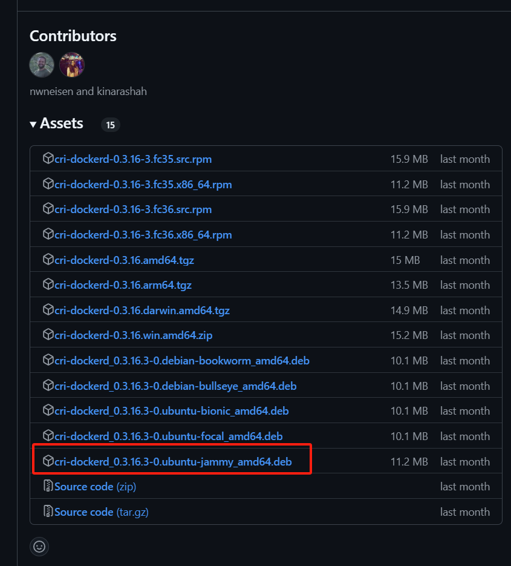

# k8s master 节点安装

## 概述

说明 k8s 大致架构，以及 master worker 的区别，说明本文着重实践 k8s master 节点的安装过程，同时说明基础的虚拟机集群可参考上一篇文章。

## 环境信息

说明基于上一篇文章的 3+1 4 节点集群规划方案，配置信息列出、操作系统版本等。计划安装的 k8s 版本。

| 主机名      | 配置 | 角色 | 系统版本 |IP |安装的组件 |
| ----------- | ----------- | ----------- |----------- |----------- |----------- |
| master1      | 2C2G40G       | master |ubuntu22.04 |192.168.33.11 |kube-vip、apiserver、controller-manager、scheduler、kubelet、etcd、kube-proxy、容器运行时、calico |
| master2      | 2C2G40G       | master |ubuntu22.04 |192.168.33.12 |kube-vip、apiserver、controller-manager、scheduler、kubelet、etcd、kube-proxy、容器运行时、calico |
| master3      | 2C2G40G       | master |ubuntu22.04 |192.168.33.13 |kube-vip、apiserver、controller-manager、scheduler、kubelet、etcd、kube-proxy、容器运行时、calico |
| node1      | 2C2G40G       | worker |ubuntu22.04 |192.168.33.14 |kubelet、kube-proxy、容器运行时、calico、coredns |

上图 + 参考之前的 vip 文章
https://blog.csdn.net/networken/article/details/132594119

## master 节点安装

说明性信息

### 步骤1：系统初始化配置

- 配置 hosts：
  ```shell
  $ cat >> /etc/hosts << EOF
  192.168.33.11 master1 
  192.168.33.12 master2 
  192.168.33.13 master3 
  192.168.33.14 node1
  EOF
  ```
  **注：** hosts 信息根据自身实际情况调整 ip 及对应的主机名。

- 关闭系统的 swap 分区：
  ```shell
  $ sed -ri 's/^([^#].*swap.*)$/#\1/' /etc/fstab && grep swap /etc/fstab && swapoff -a && free -h
  ```

- 设置内核参数：
  ```shell
  $ cat >> /etc/sysctl.conf <<EOF
  vm.swappiness = 0
  net.bridge.bridge-nf-call-iptables = 1
  net.ipv4.ip_forward = 1
  net.bridge.bridge-nf-call-ip6tables = 1
  EOF

  $ cat >> /etc/modules-load.d/neutron.conf <<EOF
  br_netfilter
  EOF

  #加载模块
  $ modprobe  br_netfilter
  #让配置生效
  $ sysctl -p
  ```
  - `vm.swappiness = 0` 表示尽可能不使用交换分区，优先使用物理内存
  - `net.bridge.bridge-nf-call-iptables = 1` 允许 iptables 规则应用于网桥流量
  - `net.ipv4.ip_forward = 1` 允许系统作为路由器转发 IPv4 数据包
  - `net.bridge.bridge-nf-call-ip6tables = 1` 允许 ip6tables 规则应用于网桥流量
  - `br_netfilter` 用于在网桥上启用 Netfilter 功能，支持 iptables 和 ip6tables 规则

### 步骤2：安装 docker

我们选择常用的 docker 作为容器运行时，当然你也可以选择其它主流选择，比如 podman。我之前的一些文章对他们有一些讲解，可供参考。

- 更新包管理器索引，确保获取最新的软件包信息：
  
  ```shell
  $ apt update
  ```

- 安装必要的工具和依赖：

  ```shell

  $ apt install -y ca-certificates curl gnupg lsb-release
  ```
  - ca-certificates：用于管理 CA 证书
  - curl：用于从网络下载文件
  - gnupg：用于管理 GPG 密钥
  - lsb-release：用于获取系统发行版信息

- 下载 Docker 的官方 GPG 密钥，并将其转换为适用于 apt 的格式：

  ```shell
  
  $ curl -fsSL https://download.docker.com/linux/ubuntu/gpg | sudo gpg --dearmor -o /usr/share/keyrings/docker-archive-keyring.gpg
  ```
  - -fsSL：静默模式下载，跟随重定向，显示错误信息
  - gpg --dearmor：将 GPG 密钥转换为二进制格式
  - 输出到 /usr/share/keyrings/docker-archive-keyring.gpg

- 添加 Docker 的官方 APT 源：

  ```shell
  
  $ echo "deb [arch=$(dpkg --print-architecture) signed-by=/usr/share/keyrings/docker-archive-keyring.gpg] https://download.docker.com/linux/ubuntu $(lsb_release -cs) stable" | sudo tee /etc/apt/sources.list.d/docker.list > /dev/null

  # 再次更新包管理器索引，以加载新添加的 Docker 源
  $ apt-get update
  ```
  - [arch=$(dpkg --print-architecture)]：自动检测系统架构（如 amd64、arm64）
  - signed-by=/usr/share/keyrings/docker-archive-keyring.gpg：指定 GPG 密钥路径
  - $(lsb_release -cs)：获取系统发行版代号（如 focal、jammy）
  - 将源配置写入 /etc/apt/sources.list.d/docker.list

- 安装 Docker 及相关组件：

  ```shell
  $ apt install docker-ce docker-ce-cli containerd.io docker-compose -y
  ```
  - docker-ce：Docker 社区版
  - docker-ce-cli：Docker 命令行工具
  - containerd.io：容器运行时
  - docker-compose：Docker 容器编排工具

- 创建 Docker 的配置文件 /etc/docker/daemon.json，并写入以下内容：
 
  ```shell

  $ cat > /etc/docker/daemon.json <<EOF
  {
    "registry-mirrors": [
      "https://docker.mirrors.ustc.edu.cn",
      "https://hub-mirror.c.163.com",
      "https://reg-mirror.qiniu.com",
      "https://registry.docker-cn.com"
    ],
    
    "exec-opts": ["native.cgroupdriver=systemd"],
    "data-root": "/data/docker",
    "log-driver": "json-file",
    "log-opts": {
      "max-size": "20m",  
      "max-file": "5"     
    }
  }
  EOF
  ```
  - `registry-mirrors` 配置 Docker 镜像加速器（国内镜像源）
  - `exec-opts` 设置 Cgroup 驱动为 systemd（适用于使用 systemd 的系统）
  - `data-root` 设置 Docker 数据存储路径为 /data/docker
  - `log-driver` 配置日志驱动为 json-file
  - `log-opts` 配置日志文件的大小和数量限制

- 重启 Docker 服务，使配置生效：

  ```shell
  $ systemctl restart docker.service
  ```

- 设置 Docker 服务开机自启：

  ```shell
  $ systemctl enable docker.service
  ```

- 查看 Docker 系统信息，验证安装和配置是否成功：

  ```shell
  docker info
  ```

### 步骤3：安装最新版本的 kubeadm、kubelet、kubectl

- 配置安装源：
  ```shell
  $ apt-get update && apt-get install -y apt-transport-https
  $ curl -fsSL https://mirrors.aliyun.com/kubernetes-new/core/stable/v1.30/deb/Release.key |
    gpg --dearmor -o /etc/apt/keyrings/kubernetes-apt-keyring.gpg
  $ echo "deb [signed-by=/etc/apt/keyrings/kubernetes-apt-keyring.gpg] https://mirrors.aliyun.com/kubernetes-new/core/stable/v1.32/deb/ /" |
    tee /etc/apt/sources.list.d/kubernetes.list
  ```
  **注**：我目前安装的是 1.32 ,如果你需要安装其他版本，替换版本号即可。
  - `apt-get update` 更新本地包索引，确保获取最新的软件包信息。
  -  `apt-get install -y apt-transport-https` 安装 apt-transport-https 包，使 apt 能够通过 HTTPS 协议访问软件源。
  - `curl -fsSL` 静默模式下载，跟随重定向，显示错误信息。
  - `gpg --dearmor` 将 GPG 密钥转换为二进制格式。
  - `-o /etc/apt/keyrings/kubernetes-apt-keyring.gpg` 将转换后的密钥保存到指定路径。
  - `[signed-by=/etc/apt/keyrings/kubernetes-apt-keyring.gpg]` 指定 GPG 密钥路径，用于验证软件包的签名。
  - `https://mirrors.aliyun.com/kubernetes-new/core/stable/v1.32/deb/` 阿里云的 Kubernetes 软件源地址。

- 安装 kubelet、kubeadm、kubectl：
  ```shell
  $ apt-get update
  $ apt-get install -y kubelet kubeadm kubectl
  ```
- 确认安装版本：
  ```shell
  $ kubectl version
  Client Version: v1.32.0
  Kustomize Version: v5.5.0

  $ kubeadm version
  kubeadm version: &version.Info{Major:"1", Minor:"32", GitVersion:"v1.32.0", GitCommit:"70d3cc986aa8221cd1dfb1121852688902d3bf53", GitTreeState:"clean", BuildDate:"2024-12-11T18:04:20Z", GoVersion:"go1.23.3", Compiler:"gc", Platform:"linux/amd64"}

  $ kubelet --version
  Kubernetes v1.32.0
  ```

- 设置 kubelet 自启动：
  ```shell
  $ systemctl enable kubelet
  ```
  **注**：此时，还不能启动 kubelet，因为集群还没配置，仅仅设置开机自启动。

### 步骤4：Docker 垫片安装 （可选）

**注**：非 docker 容器运行时可跳过本步骤。

> 自 Kubernetes v1.24 版本起，移除了对 Docker Shim 的支持，而 Docker Engine 默认并不兼容 CRI（容器运行时接口）规范，导致两者无法直接集成。为了解决这一问题，Mirantis 和 Docker 共同开发了 **cri-dockerd** 项目。该项目为 Docker Engine 提供了一个支持 CRI 规范的适配层，使得 Kubernetes 能够通过 CRI 接口管理和控制 Docker。

[cri-dockerd 项目](https://github.com/Mirantis/cri-dockerd "cri-dockerd 项目") 提供了 RPM 包，可在 github 仓库的 release 界面获取：



> Ubuntu的版本分别代表不同的大版本
> 
> 24.04：Noble
> 
> 22.04：jammy
> 
> 20.04：focal
> 
> 18.04：bionic
> 
> 16.04：xenial
> 
> 14.04：trusty

我用的是 22.04 版本，所以选择 jammy。

- 安装 cri-dockerd:
  ```shell
  $ wget https://github.com/Mirantis/cri-dockerd/releases/download/v0.3.16/cri-dockerd_0.3.16.3-0.ubuntu-jammy_amd64.deb
  $ dpkg -i ./cri-dockerd_0.3.16.3-0.ubuntu-jammy_amd64.deb
  ```
  
- 配置 cri-dockerd:
  因为国内无法下载 k8s.gcr.io 的仓库镜像，所以需要修改 cri-dockerd 使用国内镜像源，设置国内源方法如下：
  ```shell
  $ sed -ri 's@^(.*fd://).*$@\1 --pod-infra-container-image registry.aliyuncs.com/google_containers/pause@' /usr/lib/systemd/system/cri-docker.service

  # 重启
  $ systemctl daemon-reload && systemctl restart cri-docker && systemctl enable cri-docker
  ```
  - `sed -ri` 命令修改cri-docker.service 文件涉及镜像的一行内容为 `ExecStart=/usr/bin/cri-dockerd --container-runtime-endpoint fd:// --pod-infra-container-image registry.aliyuncs.com/google_containers/pause`

### 步骤5：开始初始化

- 生成初始化配置文件：
  ```shell
  $ kubeadm config print init-defaults > kubeadm.yaml
  ```

- 修改上一步生成的`kubeadm.yaml`配置文件：
  ```yaml
  apiVersion: kubeadm.k8s.io/v1beta4
  bootstrapTokens:
  - groups:
    - system:bootstrappers:kubeadm:default-node-token
    token: abcdef.0123456789abcdef
    ttl: 24h0m0s
    usages:
    - signing
    - authentication
  kind: InitConfiguration
  localAPIEndpoint:
    # 修改成当前执行操作的 master ip
    advertiseAddress: 192.168.33.11
    bindPort: 6443
  nodeRegistration:
    # 修改成 cri-dockerd 的 sock
    criSocket: unix:///run/cri-dockerd.sock
    imagePullPolicy: IfNotPresent
    imagePullSerial: true
    # 修改成当前 master 的主机名
    name: master1
    taints: null
  timeouts:
    controlPlaneComponentHealthCheck: 4m0s
    discovery: 5m0s
    etcdAPICall: 2m0s
    kubeletHealthCheck: 4m0s
    kubernetesAPICall: 1m0s
    tlsBootstrap: 5m0s
    upgradeManifests: 5m0s
  ---
  apiServer: {}
  apiVersion: kubeadm.k8s.io/v1beta4
  caCertificateValidityPeriod: 87600h0m0s
  certificateValidityPeriod: 8760h0m0s
  certificatesDir: /etc/kubernetes/pki
  clusterName: kubernetes
  controllerManager: {}
  dns: {}
  encryptionAlgorithm: RSA-2048
  etcd:
    local:
      # 按需修改 etcd 的数据目录
      dataDir: /data/etcd
  # 修改镜像加速地址
  imageRepository: registry.aliyuncs.com/google_containers
  kind: ClusterConfiguration
  # 修改成具体对应的版本号
  kubernetesVersion: 1.32.0
  # 如果是多master节点，就需要添加这项，指向代理的地址，这里暂时设置成当前master 的节点，后续到多节点设置部分，再做调整
  controlPlaneEndpoint: "master1:6443"
  networking:
    dnsDomain: cluster.local
    serviceSubnet: 10.96.0.0/12
    # 添加pod的IP地址设置（按需调整）
    podSubnet: 10.244.0.0/16
  proxy: {}
  scheduler: {}
  # 在最后添加上下面两部分
  ---
  apiVersion: kubeproxy.config.k8s.io/v1alpha1
  kind: KubeProxyConfiguration
  mode: ipvs
  ---
  apiVersion: kubelet.config.k8s.io/v1beta1
  kind: KubeletConfiguration
  cgroupDriver: systemd
  ```

- 基于上一步修改完成的 `kubeadm.yaml`文件，执行集群初始化：
  ```shell
  $ kubeadm init --config=kubeadm.yaml
  ```


## 其它

```shell
vagrant snapshot save [机器名] <snapshot_name>

vagrant snapshot list [机器名]

vagrant snapshot restore [机器名] <snapshot_name>

vagrant snapshot delete [机器名] <snapshot_name>
```