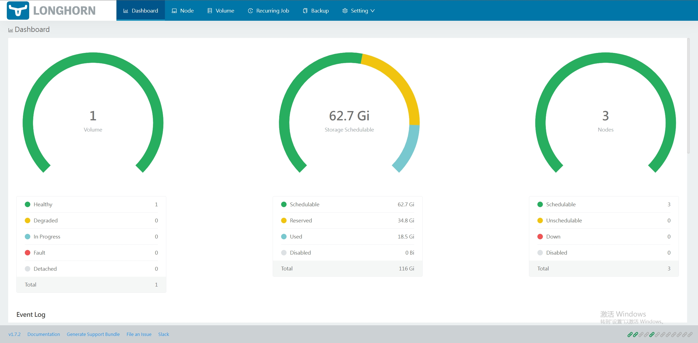

# 实战部署存储解决方案 - NFS与Longhorn

## 引言

> 在前面的文章中，我们已经通过 Vagrant 创建了集群所需的虚拟机环境，并通过 kubeadm 部署并验证了基于 Kube-Vip 的高可用集群。接下来，我们继续在集群中部署配置存储组件。

在现代云原生应用中，存储是必不可少的组件。尤其是对于生产环境中的 Kubernetes（K8s）集群，可靠的存储解决方案至关重要。本文将介绍如何在K8s 集群中部署并配置文件存储和对象存储解决方案，具体包括 Longhorn、NFS。所有这些存储组件都将通过 Helm 安装，简化了部署过程，提高了管理效率。


**集群的环境配置可参考前面的文章：**
- [高可用K8S集群搭建指南（一） : Vagrant 多节点虚拟机集群搭建](https://mp.weixin.qq.com/s/uqbpcEovKLZ61Deq_9qQGw)。
- [高可用K8S集群搭建指南（二） : Kubernetes 1.32 + Kube-Vip：高可用集群部署全攻略](https://mp.weixin.qq.com/s/PQ4bK-xRj8hd3gCBLJirPQ)。


##  存储组件的选择

关于 k8s 存储组件的对比、介绍等可参考往期文章：[七个开源最佳 Kubernetes 存储解决方案](https://mp.weixin.qq.com/s/eWTLcj0qQvHREQAPesgeiQ)、[Longhorn：Kubernetes 原生块存储](https://mp.weixin.qq.com/s/1VkPYAhgRxrOpYzqO19b7w)。接下来将对Longhorn、nfs 展开。

- **文件存储**：Longhorn 和 NFS。
  - **Longhorn**：Longhorn 是一个轻量级、高可用的分布式块存储系统，特别适用于 Kubernetes 环境。它提供易于使用的图形界面、自动快照、备份和恢复等功能，支持动态扩展，并且可以与 Kubernetes 的存储类（StorageClass）集成，满足大多数存储需求。
  - **NFS**：Network File System（NFS）是一个用于文件共享的协议，适合需要多节点共享文件的场景。NFS 在 Kubernetes 中常作为一个共享存储解决方案，适合那些需要跨多个 Pod 或节点共享数据的应用场景。

## Helm 安装工具介绍

Helm 是 Kubernetes 的包管理工具，简化了应用程序的安装、升级、删除和管理。通过 Helm，我们可以轻松地安装、配置和管理 Kubernetes 中的存储组件。详细介绍，参考之前文章：[什么是 Helm Charts？深入了解 Kubernetes 包管理器](https://mp.weixin.qq.com/s/-vljvyfpBBAUxK3w23s66w)。

**为什么选择 Helm：**
- **简化管理**：Helm 使 Kubernetes 应用的管理变得更加简便，通过定义模板和配置，自动化安装和部署。
- **易于扩展**：使用 Helm Chart 可以方便地对应用进行版本控制和升级。
- **支持社区应用**：Helm 的官方和社区仓库提供了大量经过验证的应用部署模板。

**快捷安装**：通过[helm release](https://github.com/helm/helm/releases "helm release")下载指定 OS 的二进制包，windows 设置 PATH 环境变量指向二进制程序目录，Linux 则将二进制程序放入 `/usr/local/bin/helm` 即可。（无法获取安装包的，可以到文末我的仓库中获取哦）。安装成功，通过以下命令检查：

```shell
root@master1:/opt# helm version
version.BuildInfo{Version:"v3.17.0-rc.1", GitCommit:"301108edc7ac2a8ba79e4ebf5701b0b6ce6a31e4", GitTreeState:"clean", GoVersion:"go1.23.4"}
```

**TIPS**: 可以安装在本地电脑，那么在部署 helm 应用时需要指定远端的 k8s 集群配置文件。如果直接安装在 k8s 集群 master 节点中，则只要配置了`~/.kube/config` 文件，则不需要指定配置文件。

## 安装 Longhorn

**Longhorn** 是一个开源的分布式块存储系统，可以为 Kubernetes 提供可靠的存储。

- **步骤 1：添加 Helm 仓库**

  首先，在 Helm 中添加 Longhorn 的 Helm 仓库：

  ```bash
  helm repo add longhorn https://charts.longhorn.io
  helm repo update
  ```

- **步骤 2：安装 Longhorn**

  Longhorn 的 Helm Chart 信息查看 [ArtifactHub](https://artifacthub.io/packages/helm/longhorn/longhorn "Longhorn Chart") 获取。

  - 安装 NFSv4客户端
    在 Longhorn 系统中, 备份功能需要 NFSv4, v4.1 或是 v4.2, 同时， ReadWriteMany (RWX) 卷功能需要 NFSv4.1。因此，需要在所有节点提前安装 NFSv4 客户端。
    ```bash
    apt-get install nfs-common
    ```

  - 安装 open-iscsi
    必要组件，Longhorn 依赖主机上的 iscsiadm 向 Kubernetes 提供持久卷。
    ```bash
    apt-get install open-iscsi
    systemctl enable iscsid
    systemctl start iscsid
    ```

  - 方式一：使用 Helm 安装远程 Charts ：
    
    **注：** 适用于快速部署，少量配置调整的场景。
    ```bash
    helm install longhorn longhorn/longhorn --namespace longhorn-system --create-namespace -f longhorn-values.yaml --kubeconfig=k8s.conf
    ```
    - `longhorn` 本次安装的 Chart 的实例名称(Release Name)。
    - `longhorn/longhorn` 本次安装的 Chart。
    - `--namespace` 指定目标命名空间。
    - `--create-namespace` 标识当命名空间不存在时，自动创建命名空间。
    - `-f longhorn-values.yaml` 用于指定具体的参数值，详细内容可参考文末的本人Git 仓库。
    - `--kubeconfig=k8s.conf` 用于指定目标k8s 集群的配置文件，若直接在集群中执行 helm 命令则可以不增加此参数。

  - 方式二：使用 Helm 安装本地 Charts
    
    **注：** 适用于精细部署，个性化配置，甚至调整部署的 manifest。

    下载并解压 Chart 包
   
    ```bash
    helm pull longhorn/longhorn
    tar zxf longhorn-1.7.2.tgz
    ```
    - `helm pull` 可以增加 `--version  xxxx` 用于指定具体版本，不指定，则获取最新版本。
  
    拷贝默认的 `Values` 文件：
    ```bash
    cd longhorn
    cp values.yaml longhorn-values.yaml
    ```

    vi 修改 `longhorn-values.yaml`，主要修改内容：
    ```yaml
    # 镜像调整为我的阿里云仓库，否则没有梯子拉不下来
    image:
      longhorn:
        engine:
          # -- Repository for the Longhorn Engine image.
          repository: registry.cn-shanghai.aliyuncs.com/yydd/longhornio
          # -- Tag for the Longhorn Engine image.
          tag: longhorn-engine-v1.7.2
        manager:
          # -- Repository for the Longhorn Manager image.
          repository: registry.cn-shanghai.aliyuncs.com/yydd/longhornio
          # -- Tag for the Longhorn Manager image.
          tag: longhorn-manager-v1.7.2
        ui:
          # -- Repository for the Longhorn UI image.
          repository: registry.cn-shanghai.aliyuncs.com/yydd/longhornio
          # -- Tag for the Longhorn UI image.
          tag: longhorn-ui-v1.7.2
        instanceManager:
          # -- Repository for the Longhorn Instance Manager image.
          repository: registry.cn-shanghai.aliyuncs.com/yydd/longhornio
          # -- Tag for the Longhorn Instance Manager image.
          tag: longhorn-instance-manager-v1.7.2
        shareManager:
          # -- Repository for the Longhorn Share Manager image.
          repository: registry.cn-shanghai.aliyuncs.com/yydd/longhornio
          # -- Tag for the Longhorn Share Manager image.
          tag: longhorn-share-manager-v1.7.2
        backingImageManager:
          # -- Repository for the Backing Image Manager image. When unspecified, Longhorn uses the default value.
          repository: registry.cn-shanghai.aliyuncs.com/yydd/longhornio
          # -- Tag for the Backing Image Manager image. When unspecified, Longhorn uses the default value.
          tag: backing-image-manager-v1.7.2
        supportBundleKit:
          # -- Repository for the Longhorn Support Bundle Manager image.
          repository: registry.cn-shanghai.aliyuncs.com/yydd/longhornio
          # -- Tag for the Longhorn Support Bundle Manager image.
          tag: support-bundle-kit-v0.0.45
      csi:
        attacher:
          # -- Repository for the CSI attacher image. When unspecified, Longhorn uses the default value.
          repository: registry.cn-shanghai.aliyuncs.com/yydd/longhornio
          # -- Tag for the CSI attacher image. When unspecified, Longhorn uses the default value.
          tag: csi-attacher-v4.7.0
        provisioner:
          # -- Repository for the CSI Provisioner image. When unspecified, Longhorn uses the default value.
          repository: registry.cn-shanghai.aliyuncs.com/yydd/longhornio
          # -- Tag for the CSI Provisioner image. When unspecified, Longhorn uses the default value.
          tag: csi-provisioner-v4.0.1-20241007
        nodeDriverRegistrar:
          # -- Repository for the CSI Node Driver Registrar image. When unspecified, Longhorn uses the default value.
          repository: registry.cn-shanghai.aliyuncs.com/yydd/longhornio
          # -- Tag for the CSI Node Driver Registrar image. When unspecified, Longhorn uses the default value.
          tag: csi-node-driver-registrar-v2.12.0
        resizer:
          # -- Repository for the CSI Resizer image. When unspecified, Longhorn uses the default value.
          repository: registry.cn-shanghai.aliyuncs.com/yydd/longhornio
          # -- Tag for the CSI Resizer image. When unspecified, Longhorn uses the default value.
          tag: csi-resizer-v1.12.0
        snapshotter:
          # -- Repository for the CSI Snapshotter image. When unspecified, Longhorn uses the default value.
          repository: registry.cn-shanghai.aliyuncs.com/yydd/longhornio
          # -- Tag for the CSI Snapshotter image. When unspecified, Longhorn uses the default value.
          tag: csi-snapshotter-v7.0.2-20241007
        livenessProbe:
          # -- Repository for the CSI liveness probe image. When unspecified, Longhorn uses the default value.
          repository: registry.cn-shanghai.aliyuncs.com/yydd/longhornio
          # -- Tag for the CSI liveness probe image. When unspecified, Longhorn uses the default value.
          tag: livenessprobe-v2.14.0

    # 默认配置调整
    defaultSettings:
      # 设置允许 Longhorn 仅在标签为“node.longhorn.io/create-default-disk=true”的节点上自动创建默认磁盘（如果不存在其他磁盘）。禁用此设置时，Longhorn 在添加到集群的每个节点上创建一个默认磁盘。
      createDefaultDiskLabeledNodes: ~
      # 主机上存储数据的默认路径。默认值为“/var/lib/longhorn/”。
      defaultDataPath: /data/storage/longhorn
    # 先设置ui 访问通过 NodePort 方式，后续等部署到 ingress 的文章中，再调整为 ingress 访问。
    service:
      ui:
        # 设置 ui service 为 NodePort
        type: NodePort
        # 指定端口，可用端口范围 30000 and 32767. （不指定的话会默认创建一个）
        NodePort: 30080
    ```

    执行安装：
    ```bash
    cd ..
    PS D:\workspace\github\LeDaDa-CloudNative-Camp\k8s-ha-cluster-practice\ch3\helm-charts> helm install longhorn ./longhorn --namespace longhorn-system --create-namespace -f longhorn/longhorn-values.yaml --kubeconfig=C:\Users\brains\Downloads\admin.conf
    NAME: longhorn
    LAST DEPLOYED: Wed Jan 15 15:29:30 2025
    NAMESPACE: longhorn-system
    STATUS: deployed
    REVISION: 1
    TEST SUITE: None
    NOTES:
    Longhorn is now installed on the cluster!

    Please wait a few minutes for other Longhorn components such as CSI deployments, Engine Images, and Instance Managers to be initialized.

    Visit our documentation at https://longhorn.io/docs/
    ```
    - `longhorn` 本次安装的 Chart 的实例名称(Release Name)。
    - `./longhorn` 本次安装的 Chart 文件目录。
    - `--namespace` 指定目标命名空间。
    - `--create-namespace` 标识当命名空间不存在时，自动创建命名空间。
    - `-f longhorn-values.yaml` 用于指定具体的参数值，详细内容可参考文末的本人Git 仓库。
    - `--kubeconfig=C:\Users\brains\Downloads\admin.conf` 用于指定目标k8s 集群的配置文件，若直接在集群中执行 helm 命令则可以不增加此参数。
  - Watch Pod 达到 Running 状态，代表部署成功：
    ```bash
    watch kubectl get pod -n longhorn-system -o wide
    Every 2.0s: kubectl get pod -n longhorn-system -o wide                                                           master1: Wed Jan 15 09:49:29 2025

    NAME                                                READY   STATUS    RESTARTS      AGE   IP               NODE    NOMINATED NODE   READINESS GATE
    S
    csi-attacher-94b689496-58wrs                        1/1     Running   0             10m   10.244.166.172   node1   <none>           <none>
    csi-attacher-94b689496-dgjj7                        1/1     Running   0             10m   10.244.166.165   node1   <none>           <none>
    csi-attacher-94b689496-kkzp7                        1/1     Running   0             10m   10.244.166.163   node1   <none>           <none>
    csi-provisioner-86f577fddd-9lt6r                    1/1     Running   0             10m   10.244.166.173   node1   <none>           <none>
    csi-provisioner-86f577fddd-n5gsq                    1/1     Running   0             10m   10.244.166.169   node1   <none>           <none>
    csi-provisioner-86f577fddd-xh4qh                    1/1     Running   0             10m   10.244.166.164   node1   <none>           <none>
    csi-resizer-7589b8b586-65k5c                        1/1     Running   0             10m   10.244.166.166   node1   <none>           <none>
    csi-resizer-7589b8b586-hh9bp                        1/1     Running   0             10m   10.244.166.175   node1   <none>           <none>
    csi-resizer-7589b8b586-qq4mt                        1/1     Running   0             10m   10.244.166.168   node1   <none>           <none>
    csi-snapshotter-db9dcd54f-brn58                     1/1     Running   0             10m   10.244.166.171   node1   <none>           <none>
    csi-snapshotter-db9dcd54f-nt588                     1/1     Running   0             10m   10.244.166.167   node1   <none>           <none>
    csi-snapshotter-db9dcd54f-zh44r                     1/1     Running   0             10m   10.244.166.174   node1   <none>           <none>
    engine-image-ei-bc6697f9-fc9j8                      1/1     Running   0             10m   10.244.166.160   node1   <none>           <none>
    instance-manager-81f3df2191f0e4a5a0b7c5f126c1a995   1/1     Running   0             10m   10.244.166.161   node1   <none>           <none>
    longhorn-csi-plugin-79dfm                           3/3     Running   0             10m   10.244.166.170   node1   <none>           <none>
    longhorn-driver-deployer-566cf4b476-pcq8g           1/1     Running   0             11m   10.244.166.159   node1   <none>           <none>
    longhorn-manager-hp5bf                              2/2     Running   1 (10m ago)   11m   10.244.166.158   node1   <none>           <none>
    longhorn-ui-8495965bd5-bh6pg                        1/1     Running   0             11m   10.244.166.157   node1   <none>           <none>
    longhorn-ui-8495965bd5-lsjkz                        1/1     Running   0             11m   10.244.166.156   node1   <none>           <none>
    ```


- **步骤 3：验证功能**
  - 依据部署时的参数设定，添加标签至 node1 节点：
    ```bash
    kubectl label node node1 node.longhorn.io/create-default-disk=true
    ```
  - 通过 VIP + NodePort 端口，我们的是 `192.168.33.250:30080` 访问 UI:
    
    
  - 我们可以通过开启 master 允许pod 调度，同时打上 longhorn 磁盘标签，查看具体的变化：
    ```bash
    # master2 允许调度
    kubectl taint node master2 node-role.kubernetes.io/control-plane:NoSchedule-
    # master2 打上 longhorn 创建磁盘 标签
    kubectl label node master2 node.longhorn.io/create-default-disk=true
    # master3 允许调度
    kubectl taint node master3 node-role.kubernetes.io/control-plane:NoSchedule-
    # master3 打上 longhorn 创建磁盘 标签
    kubectl label node master3 node.longhorn.io/create-default-disk=true
    ```
    可以看到已经有 3个节点可供调度：
    
  - 查看 `StorageClass` 清单：
    ```bash
    root@master1:~# kubectl get storageclass
    NAME                 PROVISIONER          RECLAIMPOLICY   VOLUMEBINDINGMODE   ALLOWVOLUMEEXPANSION   AGE
    longhorn (default)   driver.longhorn.io   Delete          Immediate           true                   34m
    longhorn-static      driver.longhorn.io   Delete          Immediate           true                   34m
    ```
    可以看到一共创建了两个 StorageClass，其中`longhorn` 是默认StorageClass，用来动态提供创建 longhorn存储，而 `longhorn-static` 是用于预先配置 PVC（静态配置）的假储存类别。
  - 创建 `test-longhorn.yaml` ，用于部署一个 Pod，并且创建 动态PVC 挂载（longhorn）：
    ```yaml
    # pvc
    apiVersion: v1
    kind: PersistentVolumeClaim
    metadata:
      name: longhorn-pvc
      namespace: default
    spec:
      accessModes:
        - ReadWriteOnce
      # 指定上面查到的动态 sc
      storageClassName: longhorn
      resources:
        requests:
          storage: 1Gi
    ---
    apiVersion: v1
    kind: Pod
    metadata:
      name: longhorn-pod
      namespace: 
    spec:
      containers:
      - name: busybox-container
        image: registry.cn-shanghai.aliyuncs.com/yydd/busybox:1.28
        # 持续往 /data/log.txt 输入日志
        command: ["/bin/sh", "-c", "while true; do echo $(date) >> /data/log.txt; sleep 5; done"]
        volumeMounts:
        # /data 目录 mount 存储 storage
        - mountPath: "/data"
          name: storage
      volumes:
      - name: storage
        persistentVolumeClaim:
          # pvc 信息
          claimName: longhorn-pvc
    ```
  - 部署 `test-longhorn.yaml`:
    ```bash
    root@master1:~/yy# kubectl apply -f test-longhorn.yaml 
    persistentvolumeclaim/longhorn-pvc created
    pod/longhorn-pod created
    root@master1:~/yy# 
    ```
  - 进入容器查看 /data/log.txt 是否持续在产生内容：
    ```bash

    root@master1:~/yy# kubectl exec -it longhorn-pod -- tail -f /data/log.txt
    Wed Jan 15 10:25:48 UTC 2025
    Wed Jan 15 10:25:53 UTC 2025
    Wed Jan 15 10:25:58 UTC 2025
    Wed Jan 15 10:26:03 UTC 2025
    Wed Jan 15 10:26:08 UTC 2025
    Wed Jan 15 10:26:13 UTC 2025
    Wed Jan 15 10:26:18 UTC 2025
    Wed Jan 15 10:26:23 UTC 2025
    Wed Jan 15 10:26:28 UTC 2025
    Wed Jan 15 10:26:33 UTC 2025
    Wed Jan 15 10:26:38 UTC 2025
    ```
    可以看到 Dashboard 中有一个 Volume ，同时 也有多副本信息：
    
    

## 安装 NFS Client Provisioner

NFS Client Provisioner 是一个 Kubernetes 存储类实现，它利用 NFS(Network File System) 来动态创建持久卷。
它的 Helm Chart 信息查看[Github](https://github.com/kubernetes-sigs/nfs-subdir-external-provisioner/tree/master/charts/nfs-subdir-external-provisioner "Nfs Client Provisioner Chart") 获取。

- **步骤 1：部署 NFS 服务端**

  首先，需要准备一个 NFS 服务器来提供存储服务。我们就使用我们 k8s 的 master1 节点。
  - 安装并配置 NFS 服务器（master1）：
    ```bash
    # 在 Ubuntu 上安装 NFS 服务器
    $ sudo apt update
    $ sudo apt install nfs-kernel-server

    # 创建共享目录
    $ sudo mkdir -p /data/nfsdata
    # 由于我们希望所有客户端都可以访问所有文件，因此我们将分配目录权限。
    $ sudo chmod -R 777 /data/nfsdata
    # 配置 NFS 导出,在文件中添加以下行
    $ cat >> /etc/exports << EOF
    /data/nfsdata *(rw,sync,no_subtree_check)
    EOF
    
    # 重新加载 NFS 配置
    $ sudo exportfs -a

    # 启动 NFS 服务
    $ sudo systemctl start nfs-kernel-server
    $ sudo systemctl enable nfs-kernel-server
    ```
  - 验证 NFS 服务正常运行：
    ```bash
    root@master1:~/yy# sudo systemctl start nfs-kernel-server
    sudo systemctl enable nfs-kernel-server
    Synchronizing state of nfs-kernel-server.service with SysV service script with /lib/systemd/systemd-sysv-install.
    Executing: /lib/systemd/systemd-sysv-install enable nfs-kernel-server
    root@master1:~/yy# systemctl status nfs-kernel-server
    ● nfs-server.service - NFS server and services
        Loaded: loaded (/lib/systemd/system/nfs-server.service; enabled; vendor preset: enabled)
        Drop-In: /run/systemd/generator/nfs-server.service.d
                └─order-with-mounts.conf
        Active: active (exited) since Thu 2025-01-16 09:58:18 UTC; 1min 34s ago
      Main PID: 388706 (code=exited, status=0/SUCCESS)
            CPU: 6ms

    Jan 16 09:58:18 master1 systemd[1]: Starting NFS server and services...
    Jan 16 09:58:18 master1 exportfs[388705]: exportfs: can't open /etc/exports for reading
    Jan 16 09:58:18 master1 systemd[1]: Finished NFS server and services.
    root@master1:~/yy# showmount -e localhost
    Export list for localhost:
    /data/nfsdata *
    ```

- **步骤 2：部署 NFS Client Provisioner**

  - helm 添加 仓库：
    ```bash
    $ helm repo add nfs-subdir-external-provisioner https://kubernetes-sigs.github.io/nfs-subdir-external-provisioner/
    $ helm repo update
    ```
    **注**：访问不了的可以跳过，通过文末的 git 仓库获取 chart 附件。
  - 安装 Charts:
    
    后续所有组件我都基于本地下载 charts 方式进行，方便管理及共享。
    ```bash
    $ helm pull nfs-subdir-external-provisioner/nfs-subdir-external-provisioner
    $ tar zxf nfs-subdir-external-provisioner-4.0.18.tgz
    $ PS D:\workspace\github\LeDaDa-CloudNative-Camp\k8s-ha-cluster-practice\ch3\helm-charts> helm install nfs-subdir-external-provisioner ./nfs-subdir-external-provisioner --namespace nfs-client-provisioner --create-namespace --set nfs.server=192.168.33.11 --set nfs.path=/data/nfsdata --set image.repository=al-provisioner --namespace nfs-client-provisioner --create-namespace --set nfs.server=192.168.33.11 --set nfs.path=/data/nfsdata --set image.repository=registry.cn-shanghai.aliyuncs.com/yydd/nfs-subdir-external-provisoner --kubeconfig=C:\Users\brains\Downloads\admin.conf
    NAME: nfs-subdir-external-provisioner
    LAST DEPLOYED: Thu Jan 16 18:31:20 2025
    NAMESPACE: nfs-client-provisioner
    STATUS: deployed
    REVISION: 1
    TEST SUITE: None
    ```
    - `nfs-subdir-external-provisioner` 本次安装的 Chart 的实例名称(Release Name)。
    - `./nfs-subdir-external-provisioner` 本次安装的 Chart 文件目录。
    - `--namespace` 指定目标命名空间。
    - `--create-namespace` 标识当命名空间不存在时，自动创建命名空间。
    - `--set nfs.server=192.168.33.11 --set nfs.path=/data/nfsdata` 用于指定上面实际部署的 NFS 服务端信息。
    - `--set image.repository=registry.cn-shanghai.aliyuncs.com/yydd/nfs-subdir-external-provisoner` 设置镜像仓库为我的阿里云仓库，加速拉取。
    - `--kubeconfig=C:\Users\brains\Downloads\admin.conf` 用于指定目标k8s 集群的配置文件，若直接在集群中执行 helm 命令则可以不增加此参数。
  - Watch Pod 达到 Running 状态，代表部署成功：
    ```bash
    root@master1:~# watch kubectl get pod -n nfs-client-provisioner -o wide
    Every 2.0s: kubectl get pod -n nfs-client-provisioner -o wide                                                         master1: Thu Jan 16 10:33:27 2025

    NAME                                               READY   STATUS    RESTARTS   AGE    IP              NODE      NOMINATED NODE   READINESS GATES
    nfs-subdir-external-provisioner-6fddd668f4-wwmhk   1/1     Running   0          2m6s   10.244.180.14   master2   <none>           <none>

    ```

- **步骤 3：验证功能**
  - 查看 `StorageClass` 清单：
    ```bash
    root@master1:~# kubectl get sc
    NAME                 PROVISIONER                                     RECLAIMPOLICY   VOLUMEBINDINGMODE   ALLOWVOLUMEEXPANSION   AGE
    longhorn (default)   driver.longhorn.io                              Delete          Immediate           true                   44h
    longhorn-static      driver.longhorn.io                              Delete          Immediate           true                   44h
    nfs-client           cluster.local/nfs-subdir-external-provisioner   Delete          Immediate           true                   19h                 34m
    ```
    可以看到创建了一个 StorageClass `nfs-client`。
  - 创建 `test-nfs.yaml` ，用于部署一个 Pod，并且创建 动态PVC 挂载（nfs-client）：
    ```yaml
    # pvc
    apiVersion: v1
    kind: PersistentVolumeClaim
    metadata:
      name: nfs-pvc
      namespace: default
    spec:
      accessModes:
        - ReadWriteOnce
      # 指定上面查到的动态 sc
      storageClassName: nfs-client
      resources:
        requests:
          storage: 1Gi
    ---
    apiVersion: v1
    kind: Pod
    metadata:
      name: nfs-pod
      namespace: 
    spec:
      containers:
      - name: busybox-container
        image: registry.cn-shanghai.aliyuncs.com/yydd/busybox:1.28
        # 持续往 /data/log.txt 输入日志
        command: ["/bin/sh", "-c", "while true; do echo $(date) >> /data/log.txt; sleep 5; done"]
        volumeMounts:
        # /data 目录 mount 存储 storage
        - mountPath: "/data"
          name: storage
      volumes:
      - name: storage
        persistentVolumeClaim:
          # pvc 信息
          claimName: nfs-pvc
    ```
  - 部署 `test-nfs.yaml`:
    ```bash
    root@master1:~/yy# kubectl apply -f test-nfs.yaml 
    persistentvolumeclaim/nfs-pvc created
    pod/nfs-pod created
    ```
  - 进入容器查看 /data/log.txt 是否持续在产生内容：
    ```bash
    root@master1:~/yy# kubectl exec -it nfs-pod -- tail -f /data/log.txt
    Fri Jan 17 06:19:55 UTC 2025
    Fri Jan 17 06:20:00 UTC 2025
    Fri Jan 17 06:20:05 UTC 2025
    Fri Jan 17 06:20:10 UTC 2025
    ```
    可以看到在 nfs 服务器 /data/nfsdata 目录下已经存在相关文件：
    ```bash
    root@master1:/data/nfsdata# ll
    total 12
    drwxrwxrwx 3 root   root    4096 Jan 17 06:19 ./
    drwx--x--x 5 root   root    4096 Jan 16 09:58 ../
    drwxrwxrwx 2 nobody nogroup 4096 Jan 17 06:19 default-nfs-pvc-pvc-3e80d8a7-e768-4bbc-8cfb-6da13b9ddcfe/

    root@master1:/data/nfsdata/default-nfs-pvc-pvc-3e80d8a7-e768-4bbc-8cfb-6da13b9ddcfe# ll
    total 12
    drwxrwxrwx 2 nobody nogroup 4096 Jan 17 06:19 ./
    drwxrwxrwx 3 root   root    4096 Jan 17 06:19 ../
    -rw-r--r-- 1 nobody nogroup  667 Jan 17 06:21 log.txt
    ```

## helm 扩展命令

```shell
# 列出已添加的 helm 仓库清单
helm repo list
# 列出某个 helm 仓库下的 charts
helm search repo [repo name]

```


> 如果你在部署过程中遇到问题，可以参考文末提供的 [github](https://github.com/yyong-brs/LeDaDa-CloudNative-Camp/tree/master/k8s-ha-cluster-practice/ch3 "GitHub 仓库") / [gitee](https://gitee.com/yuedada/LeDaDa-CloudNative-Camp/tree/master/k8s-ha-cluster-practice/ch3 "Gitee 仓库") 仓库中的相关资源。

## 总结

通过本文的实践，读者可以快速在Kubernetes集群中部署Longhorn和NFS存储组件，为云原生应用提供可靠的存储支持。使用Helm简化了安装和管理过程，使用户能够专注于应用的开发和部署。每个存储组件都有其特定的作用和适用场景，选择合适的存储解决方案可以有效提升应用的性能和可靠性。
